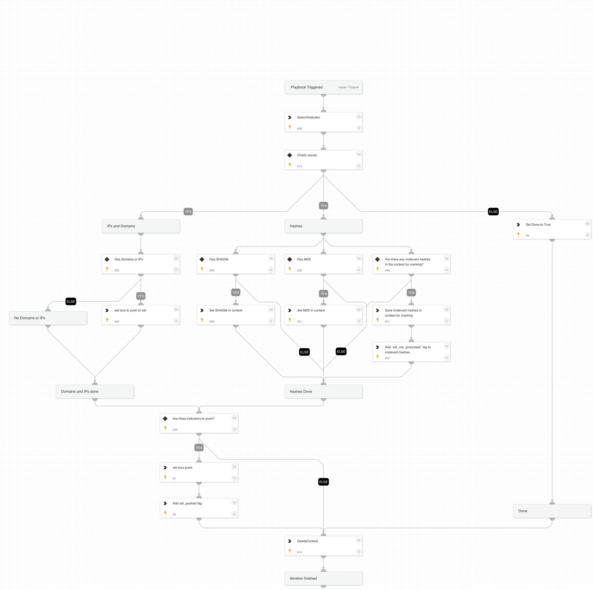

Pushes new IOCs into XDR tagging them as `xdr_pushed`.

## Dependencies

This playbook uses the following sub-playbooks, integrations, and scripts.

### Sub-playbooks

This playbook does not use any sub-playbooks.

### Integrations

* XDR_iocs

### Scripts

* DeleteContext
* GetIndicatorsByQuery
* Set
* ReadFile

### Commands

* appendIndicatorField
* xdr-iocs-push

## Playbook Inputs

---

| **Name** | **Description** | **Default Value** | **Required** |
| --- | --- | --- | --- |
| batch_size | The size of the batch of indicators to be pushed into XDR in every iteration |  | Optional |
| query | The query used to search for IOCs in XSOAR |  | Required |

## Playbook Outputs

---
There are no outputs for this playbook.

## Playbook Image

---

