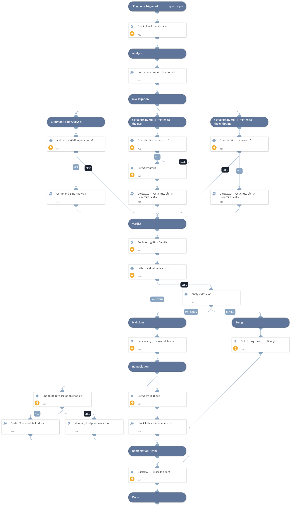

The Cortex XDR Lite - Incident Handling playbook is triggered by fetching a Palo Alto Networks Cortex XDR incident and executes the following:

Analysis:
- Enriches all the indicators from XDR incidents and alerts, providing additional context and information about these indicators.

Investigation:
- Checks for related XDR alerts to the user and the endpoint by Mitre tactics to identify malicious activity.
- Checks for specific arguments for malicious usage from the command line.

Verdict:
- Determines the incident's verdict by considering indicator enrichment results, user and host risk levels, command line analysis, and the number of related XDR alerts (medium severity or higher) to the user and the endpoint by Mitre tactics.

Verdict Handling:
- Handles malicious incidents by initiating appropriate response actions, including blocking malicious indicators, isolating endpoints, and disabling user accounts.

To utilize this playbook as the default for handling XDR incidents, the classifier should be empty, and the selected incident type should be `Cortex XDR - Lite`.
The selected Mapper (incoming) should be `XDR - Incoming Mapper`, and the selected Mapper (outgoing) should be Cortex `XDR - Outgoing Mapper`.

## Dependencies

This playbook uses the following sub-playbooks, integrations, and scripts.

### Sub-playbooks

* Cortex XDR - Isolate Endpoint
* Block Indicators - Generic v3
* Command-Line Analysis
* Entity Enrichment - Generic v3
* Cortex XDR - Get entity alerts by MITRE tactics

### Integrations

* CortexXDRIR
* Cortex XDR - IR

### Scripts

* Set
* SetAndHandleEmpty

### Commands

* xdr-get-incident-extra-data
* xdr-update-incident

## Playbook Inputs

---

| **Name** | **Description** | **Default Value** | **Required** |
| --- | --- | --- | --- |
| Username | Username. | PaloAltoNetworksXDR.Incident.alerts.user_name | Optional |
| incident_id | Incident ID. | incident.xdrincidentid | Optional |
| Hostname | Hostname. | PaloAltoNetworksXDR.Incident.alerts.host_name | Optional |
| EndpointID | XDR endpoint ID. | PaloAltoNetworksXDR.Incident.alerts.endpoint_id | Optional |
| XDRDomain | XDR instance domain. | incident.xdrurl | Optional |
| InternalRange | This input is used in the "Entity Enrichment - Generic v3" playbook. A list of internal IP ranges to check IP addresses against. The comma-separated list should be provided in CIDR notation. For example, "172.16.0.0/12,10.0.0.0/8,192.168.0.0/16" \(without quotes\). | lists.PrivateIPs | Optional |
| XDRRelatedAlertsThreshold | This is the minimum threshold for XDR-related alerts of medium severity or higher, based on MITRE tactics used to identify malicious activity on the endpoint and by the user. Example: If this input is set to '5' and it detects '6' XDR-related alerts, it will classify this check as indicating malicious activity. The default value is '5'. | 5 | Optional |
| AutoBlockIndicators | Possible values: True/False.  Default: True. Should the given indicators be automatically blocked, or should the user be given the option to choose?  If set to False - no prompt will appear, and all provided indicators will be blocked automatically. If set to True - the user will be prompted to select which indicators to block. | False | Optional |
| AutoIsolateEndpoint | Whether to isolate the endpoint automatically. | False | Optional |
| UserVerification | Possible values: True/False.  Default: False. Whether to provide user verification for blocking IPs.   False - No prompt will be displayed to the user. True - The server will ask the user for blocking verification and will display the blocking list. | False | Optional |

## Playbook Outputs

---
There are no outputs for this playbook.

## Playbook Image

---

