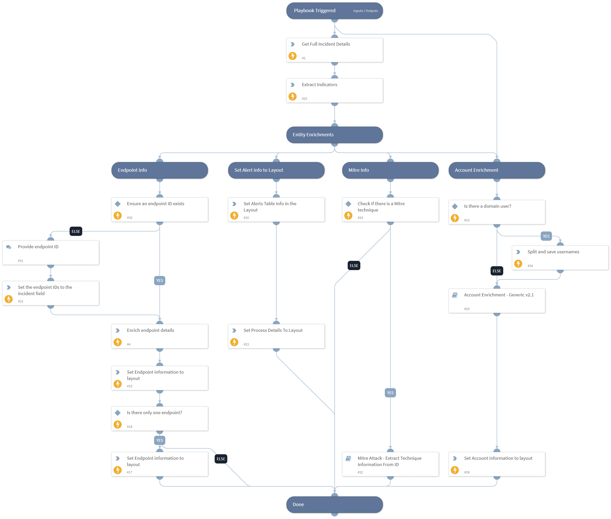

This playbook is part of the 'Malware Investigation And Response' pack. For more information, refer to https://xsoar.pan.dev/docs/reference/packs/malware-investigation-and-response.
This playbook enriches the Cortex XDR incident. The enrichment is done on the involved endpoint and Mitre technique ID information, and sets the 'Malware-Investigation and Response' layout.

## Dependencies

This playbook uses the following sub-playbooks, integrations, and scripts.

### Sub-playbooks

* Mitre Attack - Extract Technique Information From ID
* Account Enrichment - Generic v2.1

### Integrations

* Cortex XDR - IR
* CortexXDRIR

### Scripts

* isError
* SetGridField

### Commands

* extractIndicators
* endpoint
* xdr-get-incident-extra-data
* setIncident

## Playbook Inputs

---

| **Name** | **Description** | **Default Value** | **Required** |
| --- | --- | --- | --- |
| IncidentID | The incident ID to be enriched. | ${incident.externalsystemid} | Optional |

## Playbook Outputs

---

| **Path** | **Description** | **Type** |
| --- | --- | --- |
| PaloAltoNetworksXDR.Incident | Cortex XDR incident information. | unknown |
| File | File information. | unknown |
| Process | Process information. | unknown |
| IP | IP information. | unknown |
| Domain | Domain information. | unknown |
| Endpoint.ID | The endpoint identifier. | unknown |
| Endpoint.Hostname | The host name that is mapped to this endpoint. | unknown |
| Endpoint.OS | The endpoint operating system. | unknown |
| Endpoint.OSVersion | The endpoint operating system version. | unknown |
| Endpoint.IPAddress | The endpoint IP address. | unknown |
| Endpoint.Status | The health status of the endpoint. | unknown |
| Endpoint.MACAddress | The endpoint MAC address. | unknown |
| Endpoint.Vendor | The integration name of the endpoint vendor. | unknown |
| AttackPattern | Array of attack pattern names and IDs. | string |
| MITREATTACK | The full MITRE data for the attack pattern. | string |

## Playbook Image

---

