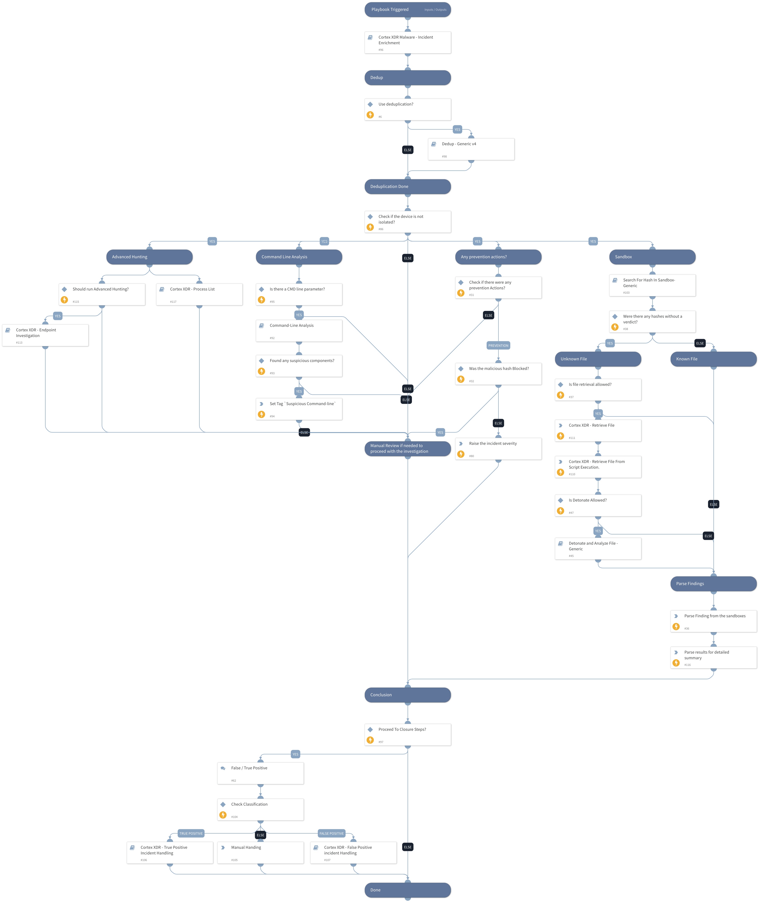

This playbook is part of the 'Malware Investigation And Response' pack. For more information, refer to https://xsoar.pan.dev/docs/reference/packs/malware-investigation-and-response.
This playbook investigates Cortex XDR malware incidents. It uses:
 - Cortex XDR insights 
 - Command Line Analysis 
 - Dedup 
 - Sandbox hash search and detonation 
 - Cortex XDR enrichment 
 - Incident Handling (True/False Positive)

## Dependencies
This playbook uses the following sub-playbooks, integrations, and scripts.

### Sub-playbooks
* Cortex XDR - False Positive Incident Handling
* Command-Line Analysis
* Cortex XDR - Retrieve File by sha256
* Detonate and Analyze File - Generic
* Cortex XDR Malware - Incident Enrichment
* Search For Hash In Sandbox - Generic
* Cortex XDR - Endpoint Investigation
* Cortex XDR - True Positive Incident Handling
* Dedup - Generic v4

### Integrations
* CortexXDRIR

### Scripts
* InvestigationDetailedSummaryParse
* InvestigationSummaryParse

### Commands
* setIncident
* xdr-script-run

## Playbook Inputs
---

| **Name** | **Description** | **Default Value** | **Required** |
| --- | --- | --- | --- |
| EnableDeduplication | Whether the deduplication playbook will be used. | False | Optional |
| AutoIsolation | Whether endpoint isolation is allowed. | False | Optional |
| RetrieveFile | Whether file retrieval from the endpoint is allowed. | True | Optional |
| TicketingSystemToUse | The name of the ticketing system to use, for example, Jira, or ServiceNow. \(Used in case incident is classified as True Positive\). |  | Optional |
| TicketProjectName | The ticket project name. \(Required for Jira\). |  | Optional |
| MaliciousTagName | The tag to assign for indicators to block. | MaliciousTagName | Optional |
| EnableClosureSteps | Whether the incident will be closed with closure steps or automatically. | True | Optional |
| DedupSimilarTextField | A comma-separated list of incident text fields to take into account when computing similarity. For example commandline, URL. | agnetsid,users,agentsid,CMDline,Hostnames,filenames,filepaths | Optional |
| AutoUnisolation | Whether automatic un-isolation is allowed. | False | Optional |
| DedupLimit | The maximum number of incidents to query and set to context data. | 200 | Optional |
| DedupHandleSimilar | Defines how to handle Similar incidents.   Choose between: "Link", "Close", "Link and Close".  Note: Closing incidents requires you to define the "CloseSimilar" input as well.  Also, the incidents found by similar indicators or fields will be closed if their similarity score is above the CloseSimilar value.  | Link | Optional |
| DedupCloseSimilar | Defines the threshold of similarity to close a similar incident. All similar incidents with similarity above this value will be closed. For example, if CloseSimilar is set to .8 and an incident has a similarity score of .9, the incident will be closed. The value should be between 0 and 1 \[0=low similarity , 1=identical\]. | 0.9 | Optional |
| DedupMinimunIncidentSimilarity | Retain incidents with a similarity score greater than the MinimunIncidentSimilarity.     Value should be between 0 to 1 \[0=low similarity, 1=identical\] | 0.2 | Optional |
| BenignTagName | The name of the tag to apply for allowed indicators. | BenignTagName | Optional |
| AdvancedHunting | 'Whether to run Advance Hunting queries through your Cortex XDR instance using the information on Alert Insights. Note: It may take some time.' | True | Optional |
| RunAllHuntMitreTactics | Whether to run the Advanced Hunting section for all Mitre Tactics. | True | Optional |
| DetonateFile | Whether file detonation is allowed on the sandbox. | True | Optional |

## Playbook Outputs
---

| **Path** | **Description** | **Type** |
| --- | --- | --- |
| PaloAltoNetworksXDR.ScriptResult.results | Palo ALto Networks Script reuslts information. | unknown |

## Playbook Image
---
