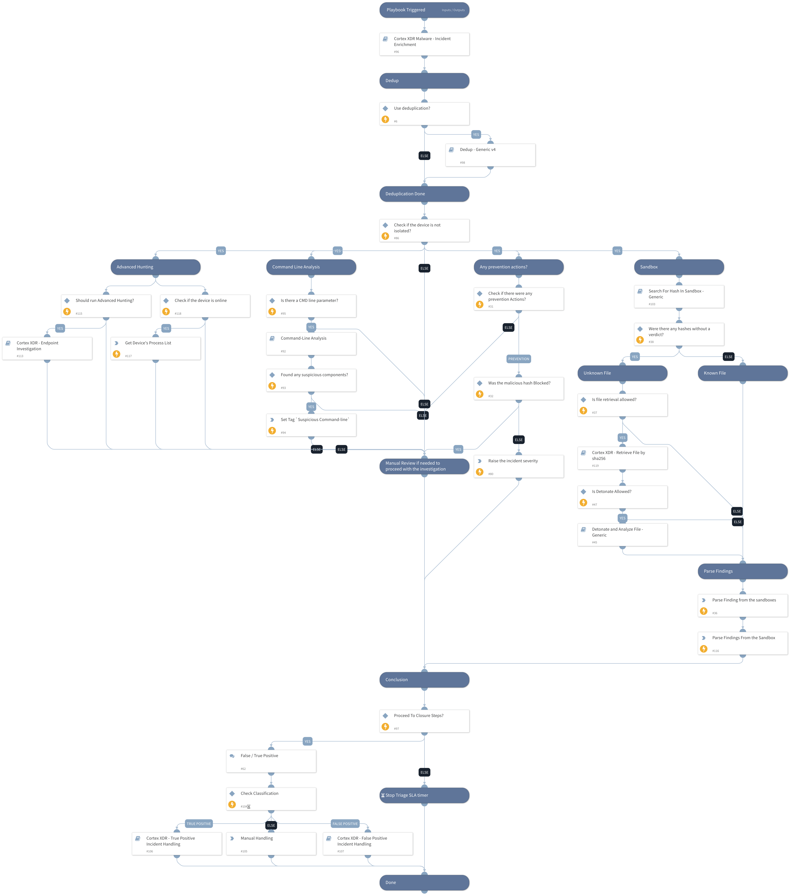

This playbook investigates Cortex XDR malware incidents. In this playbook, we are using: - Cortex XDR insights - Command Line Analysis - Dedup - Sandbox hash search and detonation - Cortex XDR enrichment - Incident Handling ( True/False Positive)

## Dependencies
This playbook uses the following sub-playbooks, integrations, and scripts.

### Sub-playbooks
* 470ceb33-1487-47a0-8337-a6c50149f385
* Command-Line Analysis
* Cortex XDR - False Positive Incident Handling
* Dedup - Generic v4
* 5d24f937-9988-4647-8247-7415e343b581
* Cortex XDR Malware - Incident Enrichment
* Cortex XDR - Endpoint Investigation
* Cortex XDR - True Positive Incident Handling
* Cortex XDR - Run script

### Integrations
* CortexXDRIR

### Scripts
* InvestigationDetailedSummaryParse
* InvestigationSummaryParse

### Commands
* xdr-file-retrieve
* setIncident
* xdr-retrieve-file-details

## Playbook Inputs
---

| **Name** | **Description** | **Default Value** | **Required** |
| --- | --- | --- | --- |
| EnableDeduplication | Indicates if the deduplication playbook will be used.     True/False | False | Optional |
| AutoIsolation | Indicates if endpoint isolation is allowed. True/False | False | Optional |
| RetrieveFile | Indicates if file retrieval from the endpoint is allowed. True/False | True | Optional |
| TicketingSystemToUse | The name of the ticketing system to use, for example, Jira or ServiceNow |  | Optional |
| TicketProjectName | For ticketing systems such as Jira, a project name is required. |  | Optional |
| MaliciousTagName | The tag to assign for indicators to block. | MaliciousTagName | Optional |
| EnableClosureSteps | Indicates if the use of closure steps is allowed or incident will close automatically.     True/False | True | Optional |
| DedupSimilarTextField | Comma-separated list of incident text fields to take into account when computing similarity. For example commandline, URL | agnetsid,users,agentsid,CMDline,Hostnames,filenames,filepaths | Optional |
| AutoUnisolation | Indicates if automatic un-isolation is allowed     True/False | False | Optional |
| DedupLimit | The maximum number of incidents to query and set to context data. Default is: 200 | 200 | Optional |
| DedupHandleSimilar | This input defines how to handle Similar incidents.  You may choose between: "Link", "Close", "Link and Close". Note: that closing incidents will require you to define "CloseSimilar" input as well. Also, note that the closer will apply on at least one of the options \(indicators or fields\) which will match the "closer percentage" criteria. Default: Link  | Link | Optional |
| DedupCloseSimilar | Define if you would like to close incidents by a similarity percentage. The percentage will be the bottom border for closing inc. This option will close also exact matches as well \( if there are\). Value should be between 0 to 1 \[0=low similarity , 1=identical\] | 0.9 | Optional |
| DedupMinimunIncidentSimilarity | Retain incidents with a similarity score that's higher than the MinimunIncidentSimilarity. Default: 0.2 Value should be between 0 to 1 \[0=low similarity, 1=identical\] | 0.2 | Optional |
| BenignTagName | The name of the tag to apply for allowed indicators. | BenignTagName | Optional |
| AdvancedHunting | Choose if you want to run Advance Hunting queries through your Cortex XDR Instance by using the information on Alert Insights. Note that it may take some time. Possible values: True / False | True | Optional |
| RunAllHuntMitreTactics | Choose True / False on running the Advanced Hunting section for all Mitre Tactics. | True | Optional |

## Playbook Outputs
---

| **Path** | **Description** | **Type** |
| --- | --- | --- |
| PaloAltoNetworksXDR.ScriptResult.results | Palo ALto Networks Script reuslts information. | unknown |

## Playbook Image
---
