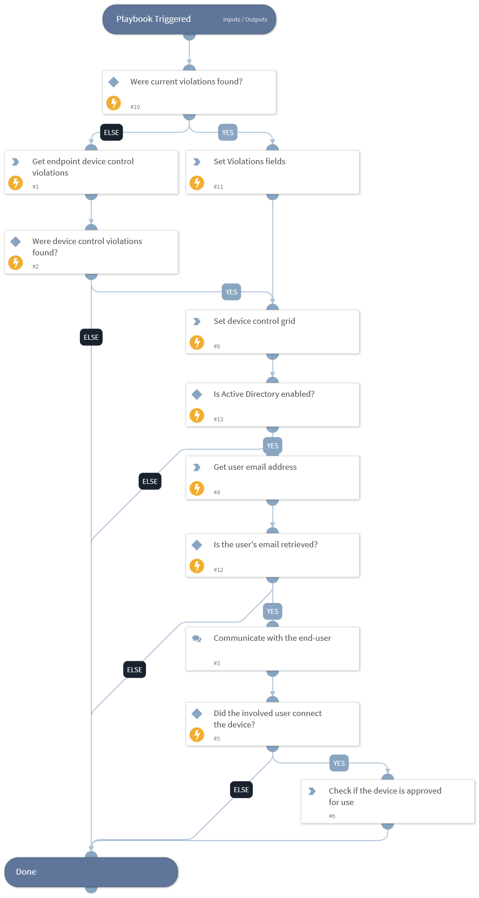

Queries Cortex XDR for device control violations for the specified hosts, IP address, or XDR endpoint ID. It then communicates via email with the involved users to understand the nature of the incident and if the user connected the device. 
All the collected data will be displayed in the XDR device control incident layout.
This playbook can also be associated with Cortex XDR device control violation job to periodically query and investigate XDR device control violations. In this configuration, the playbook will only communicate with the involved users.

## Dependencies

This playbook uses the following sub-playbooks, integrations, and scripts.

### Sub-playbooks

This playbook does not use any sub-playbooks.

### Integrations

* CortexXDRIR

### Scripts

* Set
* SetGridField

### Commands

* ad-get-user
* xdr-get-endpoint-device-control-violations

## Playbook Inputs

---

| **Name** | **Description** | **Default Value** | **Required** |
| --- | --- | --- | --- |
| TimeStamp | Timestamp in relative date format for query device control events from Cortex XDR. For example "1 day", "3 weeks". |  | Optional |
| EndpointID | Comma-separated list of endpoint IDs to filter results for. |  | Optional |
| Hostname | Comma-separated list of hostnames to filter results for. |  | Optional |
| IPAddress | Comma-separated list of endpoints IP addresses to filter results for. |  | Optional |
| MessageSubject | The subject of the message for communication with the involved users. | Device control violation | Optional |
| MessageBody | A body of the message for communication with the involved users. | Hello, Your user was involved with a device control violation. Please open the following link to fill in the needed information to understand the incident further. | Optional |

## Playbook Outputs

---
There are no outputs for this playbook.

## Playbook Image

---

