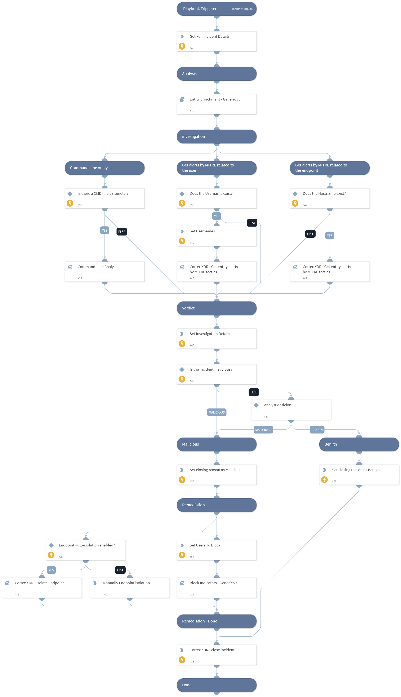

[Cortex XDR](https://www.paloaltonetworks.com/cortex/cortex-xdr) is a detection and response app that natively integrates network, endpoint, and cloud data to stop sophisticated attacks. Responding and managing these attacks requires security teams to reconcile data from multiple sources. Valuable time is lost shuttling between screens and executing repeatable tasks while an attack continues to manifest. 

This Cortex XDR content pack contains the **Palo Alto Networks Cortex XDR - Investigation and Response** integration that enables direct execution of Cortex XDR actions within Cortex XSOAR. The **Cortex XDR Incident Handling v3** playbook enables bidirectional incident updates between Cortex XDR and Cortex XSOAR. 

## What does this pack do?
The playbooks included in this pack help you save time and keep your incidents in sync. They also help automate repetitive tasks associated with Cortex XDR incidents:

- Syncs and updates Cortex XDR incidents.
- Triggers a sub-playbook to handle each alert by type.
- Extracts and enriches all relevant indicators from the source alert.
- Hunts for related IOCs.
- Calculates the severity of the incident.
- Interacts with the analyst to choose a remediation path or close the incident as a false positive based on the gathered information and incident severity.
- Remediates the incident by blocking malicious indicators and isolating infected endpoints.

As part of this pack, you will also get out-of-the-box Cortex XDR incident type views, with incident fields and a full layout to facilitate analyst investigation. All of these are easily customizable to suit the needs of your organization.

_For more information, visit our [Cortex XSOAR Developer Docs](https://xsoar.pan.dev/docs/reference/packs/palo-alto-networks-cortex-xdr---investigation-and-response)_

