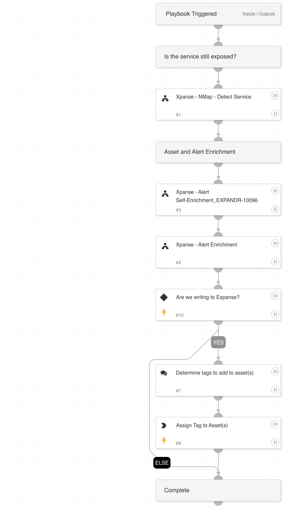

Default alert handling for Cortex Xpanse alerts.

## Dependencies

This playbook uses the following sub-playbooks, integrations, and scripts.

### Sub-playbooks

* Xpanse - NMap - Detect Service
* Xpanse - Alert Self-Enrichment
* Xpanse - Alert Enrichment

### Integrations

Cortex Xpanse

### Scripts

This playbook does not use any scripts.

### Commands

asm-tag-asset-assign

## Playbook Inputs

---

| **Name** | **Description** | **Default Value** | **Required** |
| --- | --- | --- | --- |
| WriteToXpanse | Whether to write data back to Cortex Expanse. | False | Optional |

## Playbook Outputs

---
There are no outputs for this playbook.

## Playbook Image

---

