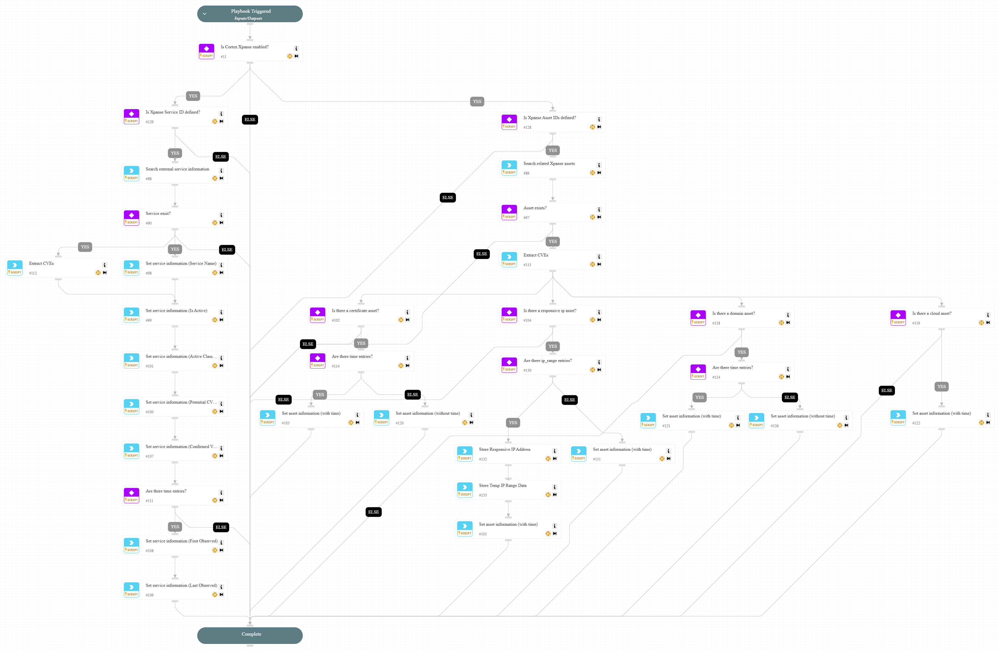

This playbook handles ASM alerts by enriching alert information with Xpanse service and asset details.

## Dependencies

This playbook uses the following sub-playbooks, integrations, and scripts.

### Integrations

Cortex Xpanse

### Scripts

GridFieldSetup

### Commands

* asm-list-external-service
* asm-list-asset-internet-exposure
* asm-get-external-service

## Playbook Inputs

---

| **Name**                        | **Description**                                                                                                                                                                                                                                                                      | **Default Value** | **Required** |
|---------------------------------|--------------------------------------------------------------------------------------------------------------------------------------------------------------------------------------------------------------------------------------------------------------------------------------|  | --- |
| Provider                        | The externally detected provider for the alert.                                                                                                                                                                                                                                      | ${incident.xpanseprovider} | Required |
| IP                              | The external IP address associated with the alert.                                                                                                                                                                                                                                   | ${incident.xpanseip} | Required |

## Playbook Outputs

---
There are no outputs for this playbook.

## Playbook Image

---

