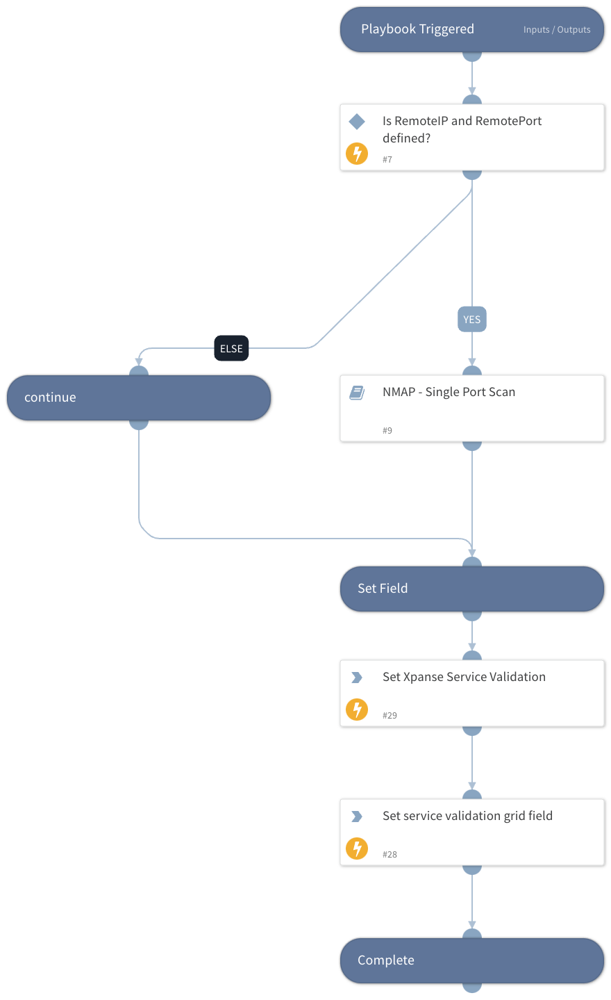

Playbook that looks at what ASM sub-type the alert is and directs it to different pre/post mitigation scans (such as NMAP, SNMP).

## Dependencies

This playbook uses the following sub-playbooks, integrations, and scripts.

### Sub-playbooks

NMAP - Single Port Scan

### Integrations

This playbook does not use any integrations.

### Scripts

GridFieldSetup

### Commands

This playbook does not use any commands.

## Playbook Inputs

---

| **Name**   | **Description**                                                    | **Default Value**   | **Required** |
|------------|--------------------------------------------------------------------|---------------------|--------------|
| RemoteIP   | Remote IP address in the alert.                                    | incident.xpanseip   | Optional     |
| RemotePort | Remote port number in the alert.                                   | incident.xpanseport | Optional     |
| ScanNumber | Scan number in case there are multiple IDs in the parent playbook. |                     | Required     |

## Playbook Outputs

---
There are no outputs for this playbook.

## Playbook Image

---

