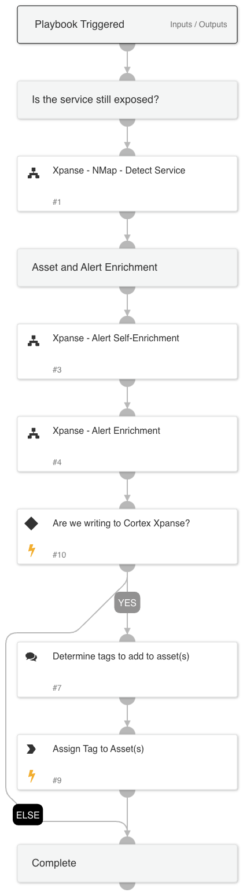

The **Cortex Xpanse** pack is supported by Cortex Xpanse Active ASM.

Cortex Xpanse Active ASM is the best in class External Attack Surface Management solutions that strive to proactively reduce the frequency and severity of security incidents caused by internet-exposed risks. These solutions deliver comprehensive attack surface visibility by combining thorough, ML enhanced asset attribution with continuous attack surface assessment. Discovered risks are prioritized using contextual information and exploitability data, and findings are actioned on through curated automated playbooks to investigate, remediate, and summarize every new alert.

> **Note**: This pack supports Cortex Xpanse Active ASM which may also be referred to as Expander v2 or using it's `major.minor` version, i.e. Expander 2.X.

## What does this pack do?
This pack contains an integration for fetching ASM alerts from Cortex Xpanse Active ASM.

## Playbooks

## Expanse - Alert Handler
This playbook is the default handler for Cortex Xpanse alerts that focuses primarily on enrichment.

## Expanse - Alert Enrichment
This playbook handles ASM alerts by enriching asset information via integrations with Cloud Service Providers and other IT and Security tools.

## Expanse - Alert Self-Enrichment
This playbook handles ASM alerts by enriching alert information with Xpanse service and asset details.

## Expanse - NMap - Detect Service
This playbook confirms the observability of a risk by running a quick port scan using NMap.
