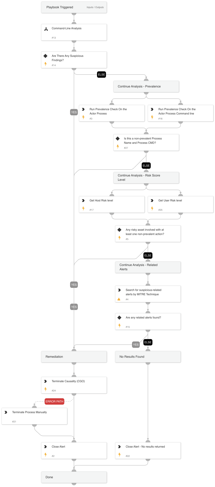

This playbook is designed to handle the following alerts:  
- Possible LDAP enumeration by unsigned process.
- Suspicious LDAP search query executed.

The playbook executes the following stages:

Investigation:
Check the following parameters to determine if remediation actions are needed:
- Cortex XSIAM alerts related to the hostname by MITRE tactics indicating malicious activity.
- Whether the Actor Process Command line contains suspicious arguments.
- Checks for prevalence of the Actor Process Name and Actor Process CMD.
- Host risk score is "Medium" or "High".
- User risk score is "High".

Remediation:
- Handles malicious alerts terminating the causality process.
- Handles non-malicious alerts identified during the investigation.

## Dependencies

This playbook uses the following sub-playbooks, integrations, and scripts.

### Sub-playbooks

Command-Line Analysis

### Integrations

CortexCoreIR

### Scripts

SearchAlertsV2

### Commands

* core-terminate-causality
* core-list-risky-hosts
* closeInvestigation
* core-get-process-analytics-prevalence
* core-get-cmd-analytics-prevalence
* core-list-risky-users

## Playbook Inputs

---
There are no inputs for this playbook.

## Playbook Outputs

---
There are no outputs for this playbook.

## Playbook Image

---

