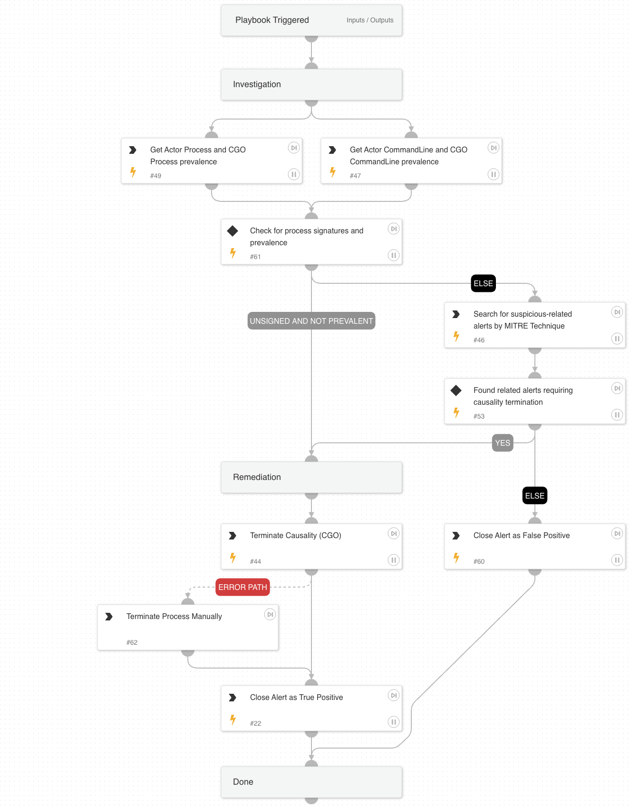

This playbook is designed to handle the 'Unprivileged process opened a registry hive' alert.

Playbook Stages:

  Investigation:

  During the alert investigation, the playbook will perform the following:

  - Checks the prevalence of the unprivileged process that triggered the alert.
  - Checks the prevalence of the command line used by the unprivileged process.
  - Searches for additional suspicious Cortex XSIAM alerts within the same incident in order to determine whether a remediation measure is required.

Remediation:

- To prevent malicious activity from continuing, the playbook terminates the causality processes that triggered the alert.

## Dependencies

This playbook uses the following sub-playbooks, integrations, and scripts.

### Sub-playbooks

This playbook does not use any sub-playbooks.

### Integrations

* CortexCoreIR

### Scripts

* SearchIncidentsV2

### Commands

* closeInvestigation
* core-get-cmd-analytics-prevalence
* core-get-process-analytics-prevalence
* core-terminate-causality

## Playbook Inputs

---
There are no inputs for this playbook.

## Playbook Outputs

---
There are no outputs for this playbook.

## Playbook Image

---

