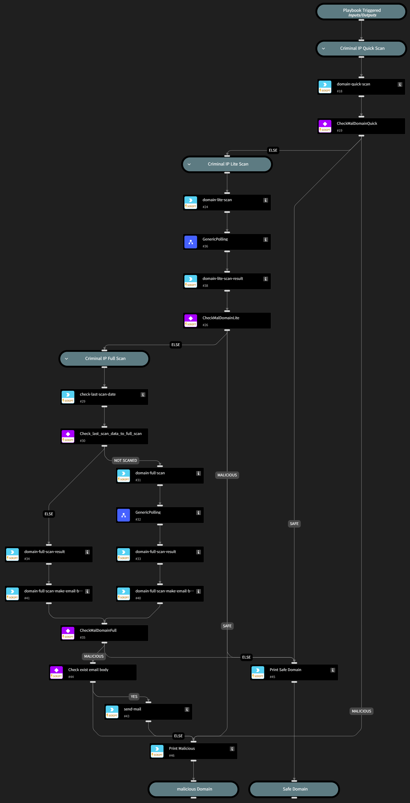

Performs Quick, Lite, and Full scans in sequence using the Criminal IP API to determine whether the input domain is malicious or not. 

If a determination cannot be made from the Quick scan, a Lite scan is performed. 

Similarly, if a determination cannot be made from the Lite scan, a Full scan is performed to make a determination. 

Additionally, if a Full scan is conducted, an overview report of notable findings is compiled through domain-full-scan-make-email-body and sent via email.

For this purpose, the user needs to fill in the arguments for the #43 send-mail command.

## Dependencies
This playbook uses the following sub-playbooks, integrations, and scripts.

### Sub-playbooks
* GenericPolling

### Integrations
* Criminal IP
* mail-sender

### Scripts
* print

### Commands
* domain-full-scan
* domain-full-scan-make-email-body
* domain-full-scan-result
* domain-full-scan-status
* domain-lite-scan
* domain-lite-scan-result
* domain-lite-scan-status
* domain-quick-scan
* check-last-scan-date
* send-mail

## Playbook Inputs
---

| **Name** | **Description** | **Default Value** | **Required** |
| --- | --- | --- | --- |
| Domain | Domain to determine whether it is malicious or not |  | Required |

## Playbook Image
---
