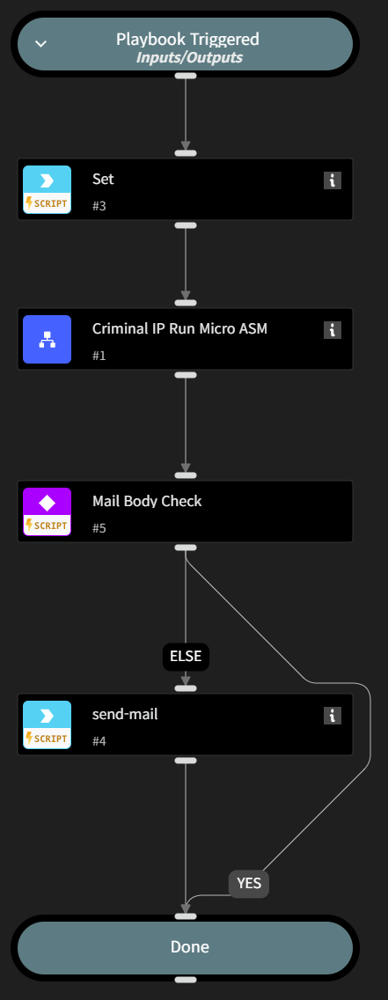

This playbook accepts a list of domains as input and sequentially executes the sub-playbook ‘Criminal IP Run Micro ASM’ for each domain in the list. After processing all domains, it aggregates the individual Micro ASM results and sends a summary to the user via email. 

Accordingly, the user must configure the required parameters for the #4 send-mail command to enable email delivery. 

Additionally, this playbook can be registered as a scheduled job to fully automate the process.

## Dependencies
This playbook uses the following sub-playbooks, integrations, and scripts.

### Sub-playbooks
* Criminal IP Run Micro ASM

### Integrations
* Criminal IP
* mail-sender

### Scripts
* set

### Commands
* send-mail

## Playbook Inputs
---

| **Name** | **Description** | **Default Value** | **Required** |
| --- | --- | --- | --- |
| Domains | A list of domains that require Micro ASM analysis. This must be provided as a list-type input.  ex) [ "www.example.com",  "www.criminalip.io" ] |  | Required |

## Playbook Image
---
