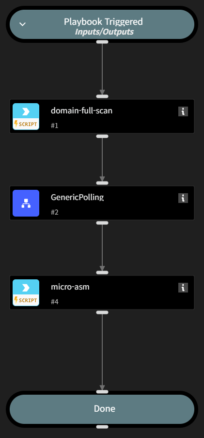

This playbook accepts a list of domains as input. For each individual domain, it performs a full domain scan (domain-full-scan). Once the scan is completed, it proceeds to execute Micro ASM on the scanned domain..

The results of the Micro ASM analysis are stored in the playbook’s context.

This playbook is intended to be used as a sub-playbook within the "Criminal IP Micro ASM" playbook.

For additional information, please refer to the documentation of the "Criminal IP Micro ASM" playbook.

## Dependencies
This playbook uses the following sub-playbooks, integrations, and scripts.

### Sub-playbooks
* GenericPolling

### Integrations
* Criminal IP

### Scripts
This playbook does not use any scripts.

### Commands
* domain-full-scan
* domain-full-scan-status
* micro-asm

## Playbook Inputs
---

| **Name** | **Description** | **Default Value** | **Required** |
| --- | --- | --- | --- |
| Domain | A single domain to be analyzed using micro-asm |  | Required |

## Playbook Image
---
