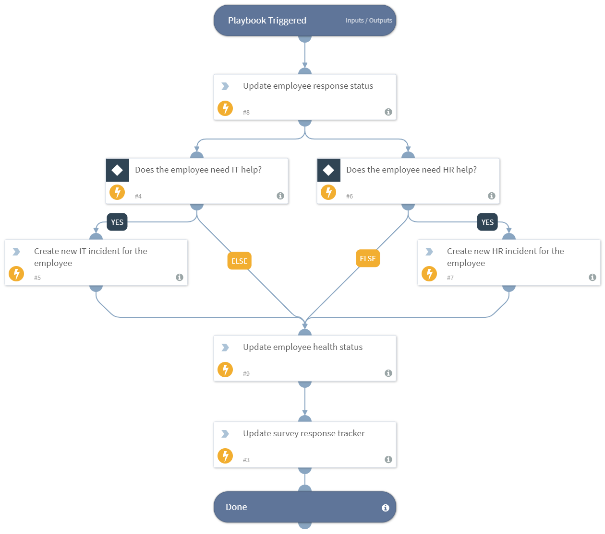

Note: This is a beta playbook, which lets you implement and test pre-release software. Since the playbook is beta, it might contain bugs. Updates to the playbook during the beta phase might include non-backward compatible features. We appreciate your feedback on the quality and usability of the playbook to help us identify issues, fix them, and continually improve. This playbook processes the survery responses. It updates that the employee responded to the survey and what their health status is. If necessary, it opens IT or HR incidents, and updates the process survey tracker.

## Dependencies
This playbook uses the following sub-playbooks, integrations, and scripts.

### Sub-playbooks
This playbook does not use any sub-playbooks.

### Integrations
* Builtin

### Scripts
* Set

### Commands
* createNewIndicator
* createNewIncident

## Playbook Inputs
---
There are no inputs for this playbook.

## Playbook Outputs
---
There are no outputs for this playbook.

## Playbook Image
---
