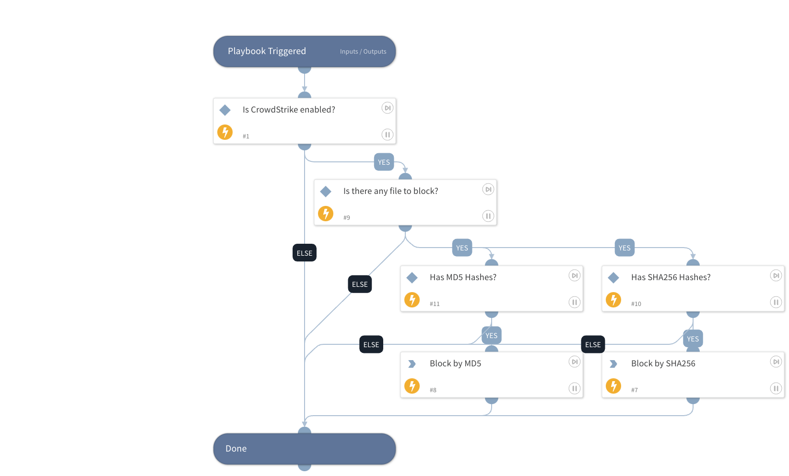

This playbook receives an MD5 or a SHA256 hash and adds it to the block list in CrowdStrike Falcon. 
The playbook uses the integration "CrowdStrike Falcon".

## Dependencies

This playbook uses the following sub-playbooks, integrations, and scripts.

### Sub-playbooks

This playbook does not use any sub-playbooks.

### Integrations

CrowdStrikeFalcon

### Scripts

IsIntegrationAvailable

### Commands

cs-falcon-upload-custom-ioc

## Playbook Inputs

---

| **Name** | **Description** | **Default Value** | **Required** |
| --- | --- | --- | --- |
| Severity  | The severity of the indicator \(informational, low, medium, high and critical\)  | medium | Required |
| Hash | In this input you can insert either MD5 or SHA256 to block. |  | Optional |

## Playbook Outputs

---
There are no outputs for this playbook.

## Playbook Image

---

