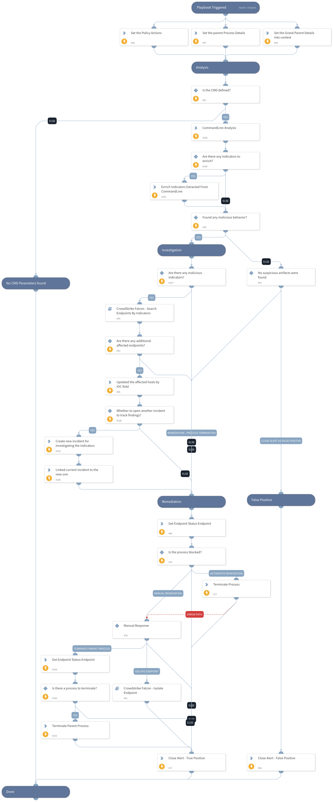

This playbook handles command and scripting interpreter alerts based on the MITRE T1059 technique.
An attacker might abuse command and script interpreters to execute commands, scripts, or binaries.

The playbook executes the following stages:

**Analysis**

- Initiates the CommandLineAnalysiss script which will determine if the command lines have any suspicious artifacts that might indicate malicious behavior.
- Enriches any indicators found during the command lines analysis phase.

**Investigative Actions:**
- In case malicious indicators were found, the playbook will initiate a check against CrowdStrike Falcon to identify if any other endpoint has been associated with the same indicators.  
- If there are any, the playbook will update the layout and create a new incident for further investigation.

**Remediation:**

- Terminate the process if the CrowdStike Falcon agent doesn't block it.
- If the process failed or the parent process command line was suspicious as well, a manual action will be provided to the analyst to choose how to proceed further:
    - Terminate the parent process
    - Isolate the endpoint  
    
**Closure Steps:**

- Handle malicious alerts by closing the alert as True Positive.
- Handle non-malicious alerts by closing the alert as False Positive.

## Dependencies

This playbook uses the following sub-playbooks, integrations, and scripts.

### Sub-playbooks

* CrowdStrike Falcon - Search Endpoints By Indicators
* Crowdstrike Falcon - Isolate Endpoint

### Integrations

* CrowdStrikeFalcon
* CrowdstrikeFalcon

### Scripts

* CommandLineAnalysis
* SetAndHandleEmpty

### Commands

* closeInvestigation
* createNewIncident
* cs-falcon-rtr-kill-process
* endpoint
* enrichIndicators
* linkIncidents
* setIncident

## Playbook Inputs

---

| **Name** | **Description** | **Default Value** | **Required** |
| --- | --- | --- | --- |
| CommandLines | The command line analysis that was found in the alert. By default, we will analyze the command line and its parent command line. | incident.commandline | Optional |
| CreateNewIncidentForIndicators | If the playbook identifies malicious indicators associated with other hosts, a new incident will be generated with relevant information for the analysts. | True | Optional |

## Playbook Outputs

---
There are no outputs for this playbook.

## Playbook Image

---

