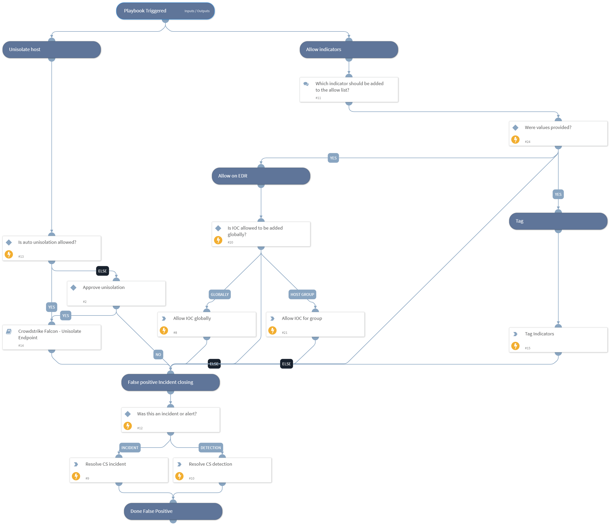

This playbook is part of the 'Malware Investigation And Response' flow. For more information, refer to https://xsoar.pan.dev/docs/reference/packs/malware-investigation-and-response.
This playbook handles a CrowdStrike incident that was determined to be false positive by the analyst.  
Actions include unisolating the host, allowing the indicator by the EDR, and tagging it.

## Dependencies
This playbook uses the following sub-playbooks, integrations, and scripts.

### Sub-playbooks
Crowdstrike Falcon - Unisolate Endpoint

### Integrations
CrowdStrikeFalcon

### Scripts
This playbook does not use any scripts.

### Commands
* setIndicators
* cs-falcon-upload-custom-ioc
* cs-falcon-resolve-incident
* cs-falcon-resolve-detection

## Playbook Inputs
---

| **Name** | **Description** | **Default Value** | **Required** |
| --- | --- | --- | --- |
| AutoUnisolation | Whether automatic un-isolation is allowed. | false | Optional |
| HostId | The host ID to unisolate. |  | Optional |
| AllowIOCTagName | The name of the tag to apply to allowed indicators. |  | Optional |
| ApplyAllowIOCGlobally | Whether adding to the allow list is global. If False, set the AllowHostGroup input to the group name. | True | Optional |
| AllowHostGroupName | The name of the allow list group to apply in case ApplyAllowIOCGlobally is set to False. |  | Optional |
| CloseNotes | Provide the close notes to be listed in CrowdStrike Falcon. |  | Optional |
| Sha256 | The SHA256 value to manage. |  | Optional |

## Playbook Outputs
---
There are no outputs for this playbook.

## Playbook Image
---

