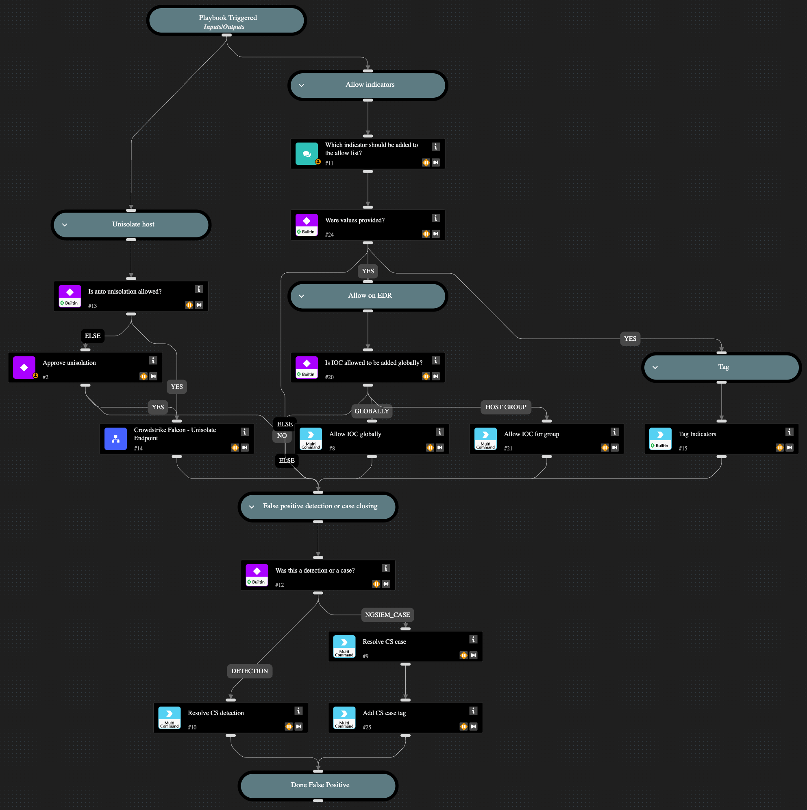

This playbook is part of the 'Malware Investigation And Response' pack. For more information, refer to https://xsoar.pan.dev/docs/reference/packs/malware-investigation-and-response.
This playbook handles a CrowdStrike incident that was determined
to be a false positive by the analyst. Actions include unisolating the host, allowing
the indicator by the EDR, and tagging it.

## Dependencies

This playbook uses the following sub-playbooks, integrations, and scripts.

### Sub-playbooks

* Crowdstrike Falcon - Unisolate Endpoint

### Integrations

* CrowdStrikeFalcon

### Scripts

This playbook does not use any scripts.

### Commands

* cs-falcon-resolve-incident
* setIndicators
* cs-falcon-resolve-detection
* cs-falcon-upload-custom-ioc

## Playbook Inputs

---

| **Name** | **Description** | **Default Value** | **Required** |
| --- | --- | --- | --- |
| AutoUnisolation | Whether automatic un-isolation is allowed. | false | Optional |
| HostId | The host ID to unisolate. |  | Optional |
| AllowIOCTagName | The tag name to apply to the allowed indicator. |  | Optional |
| ApplyAllowIOCGlobally | Whether the indicator is globally added to the allow list. If 'false', specify the group name for the AllowHostGroup input. | True | Optional |
| AllowHostGroupName | The name of the allow list group to apply if ApplyAllowIOCGlobally is set to 'false'. |  | Optional |
| CloseNotes | The close notes to be listed in CrowdStrike. |  | Optional |
| Sha256 | The SHA256 value to manage. |  | Optional |

## Playbook Outputs

---
There are no outputs for this playbook.

## Playbook Image

---

