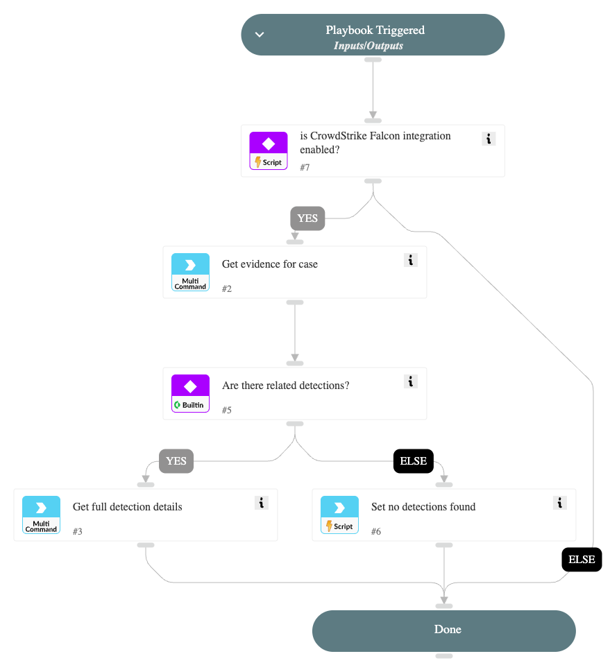

This playbook is part of the 'Malware Investigation And Response' pack. For more information, refer to <https://xsoar.pan.dev/docs/reference/packs/malware-investigation-and-response>.
This playbook enables getting CrowdStrike Falcon detection (alerts) details based on the CrowdStrike case ID.

## Dependencies

This playbook uses the following sub-playbooks, integrations, and scripts.

### Sub-playbooks

This playbook does not use any sub-playbooks.

### Integrations

* CrowdStrikeFalcon

### Scripts

* IsIntegrationAvailable
* Set

### Commands

* cs-falcon-get-evidence-for-case
* cs-falcon-search-detection

## Playbook Inputs

---

| **Name** | **Description** | **Default Value** | **Required** |
| --- | --- | --- | --- |
| CaseID | The ID of the CrowdStrike Case. |  | Optional |

## Playbook Outputs

---

| **Path** | **Description** | **Type** |
| --- | --- | --- |
| CrowdStrike.Detection.Behavior | CrowdStrike Detection Details. | string |
| CrowdStrike.FoundDetections | Indicates whether detections were found.  | string |

## Playbook Image

---

