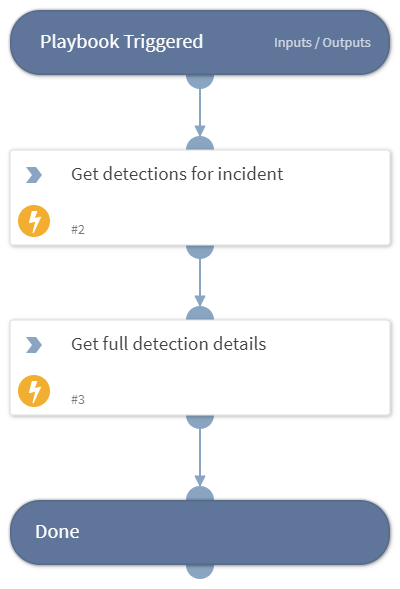

This playbook is part of the 'Malware Investigation And Response' pack. For more information, refer to https://xsoar.pan.dev/docs/reference/packs/malware-investigation-and-response.
This playbook enables getting CrowdStrike Falcon detection details based on the CrowdStrike incident ID.

## Dependencies
This playbook uses the following sub-playbooks, integrations, and scripts.

### Sub-playbooks
This playbook does not use any sub-playbooks.

### Integrations
CrowdStrikeFalcon

### Scripts
This playbook does not use any scripts.

### Commands
* cs-falcon-get-detections-for-incident
* cs-falcon-search-detection

## Playbook Inputs
---

| **Name** | **Description** | **Default Value** | **Required** |
| --- | --- | --- | --- |
| IncidentID | The ID of the CrowdStrike incident. |  | Optional |

## Playbook Outputs
---

| **Path** | **Description** | **Type** |
| --- | --- | --- |
| CrowdStrike.Detection.Behavior | CrowdStrike Detection Details. | string |

## Playbook Image
---

