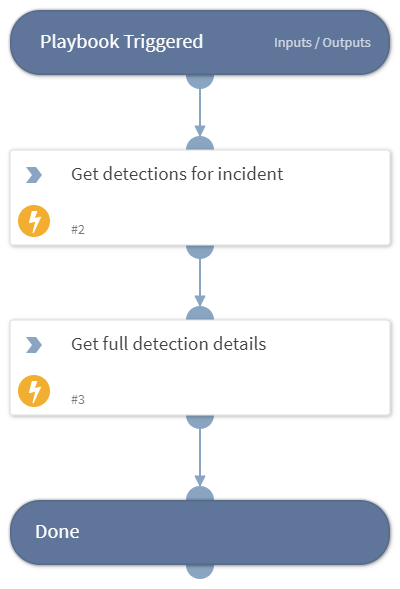

This playbook enabled to get the CrowdStrike detections details based on the CrowdStrike incident ID.

## Dependencies
This playbook uses the following sub-playbooks, integrations, and scripts.

### Sub-playbooks
This playbook does not use any sub-playbooks.

### Integrations
* CrowdStrikeFalcon

### Scripts
This playbook does not use any scripts.

### Commands
* cs-falcon-get-detections-for-incident
* cs-falcon-search-detection

## Playbook Inputs
---

| **Name** | **Description** | **Default Value** | **Required** |
| --- | --- | --- | --- |
| IncidentID | The id of the CrowdStike incident. |  | Optional |

## Playbook Outputs
---

| **Path** | **Description** | **Type** |
| --- | --- | --- |
| CrowdStrike.Detection.Behavior | CrowdStrike Detaction Details | string |

## Playbook Image
---
