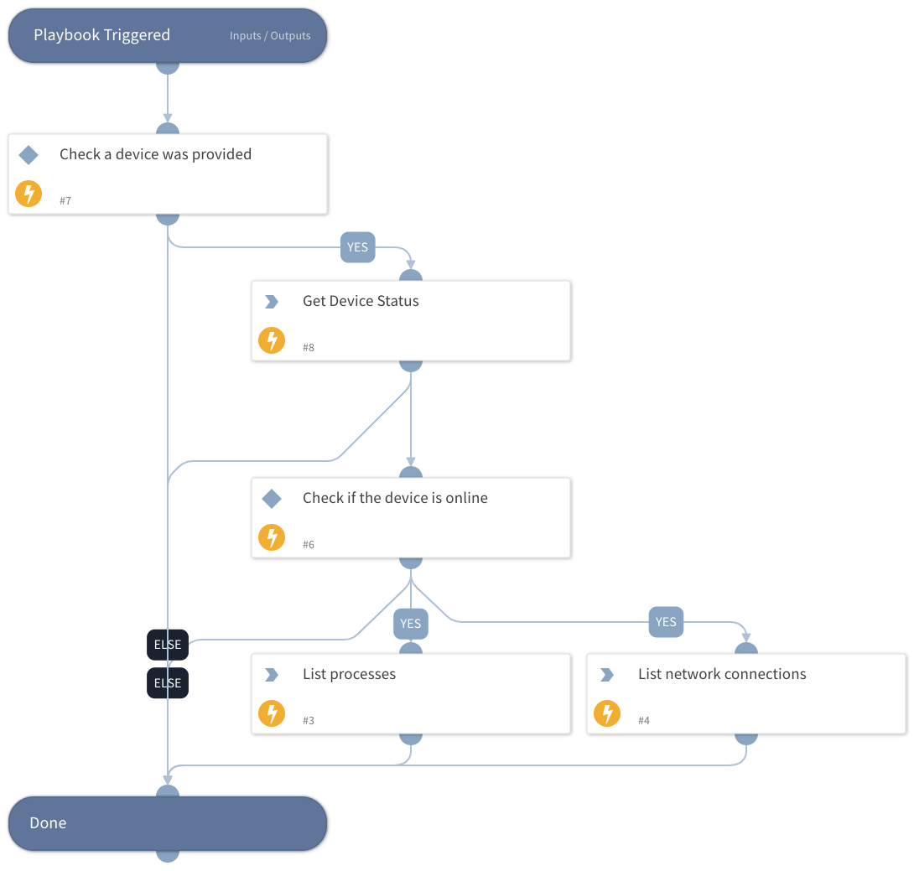

This playbook is part of the 'Malware Investigation And Response' flow. For more information, please refer to https://xsoar.pan.dev/docs/reference/packs/malware-investigation-and-response.
This playbook extracts data from the host using RTR commands. For example, commands for getting a list of running processes and network connections.

## Dependencies
This playbook uses the following sub-playbooks, integrations, and scripts.

### Sub-playbooks
This playbook does not use any sub-playbooks.

### Integrations
CrowdStrikeFalcon

### Scripts
This playbook does not use any scripts.

### Commands
* cs-falcon-rtr-list-processes
* cs-falcon-rtr-list-network-stats

## Playbook Inputs
---

| **Name** | **Description** | **Default Value** | **Required** |
| --- | --- | --- | --- |
| DeviceId | The ID of the host to use. |  | Optional |

## Playbook Outputs
---

| **Path** | **Description** | **Type** |
| --- | --- | --- |
| CrowdStrike.Command | The results of the forensics commands. | string |

## Playbook Image
---

