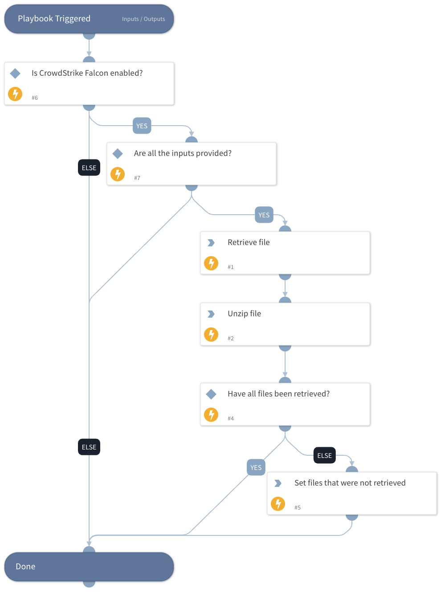

This playbook is part of the 'Malware Investigation And Response' pack. For more information, refer to https://xsoar.pan.dev/docs/reference/packs/malware-investigation-and-response.
This playbook retrieves and unzips files from CrowdStrike Falcon and returns a list of the files that were and were not retrieved.

## Dependencies

This playbook uses the following sub-playbooks, integrations, and scripts.

### Sub-playbooks

This playbook does not use any sub-playbooks.

### Integrations

* CrowdStrikeFalcon

### Scripts

* Set
* UnzipFile
* IsIntegrationAvailable

### Commands

* cs-falcon-rtr-retrieve-file

## Playbook Inputs

---

| **Name** | **Description** | **Default Value** | **Required** |
| --- | --- | --- | --- |
| HostId | The ID of the host to use. |  | Optional |
| PathsToGet | The path to retrieve the file from the host. |  | Optional |
| ZipPassword | Default password to unzip files retrieved by CrowdStrike Falcon. | infected | Optional |
| FileNames | The names of the file to retrieve. This is used to validate that all the intended files were retrieved, not to specify which ones will be retrieved.    |  | Optional |

## Playbook Outputs

---

| **Path** | **Description** | **Type** |
| --- | --- | --- |
| ExtractedFiles | A list of file names that were extracted from the ZIP file. | string |
| NonRetrievedFiles | A list of files that were not retrieved. | string |

## Playbook Image

---

