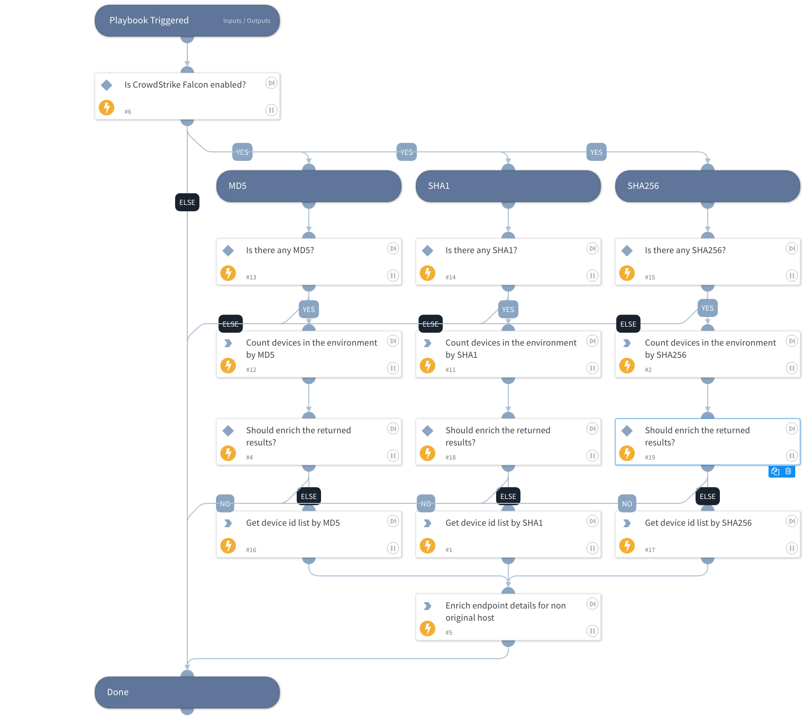

This playbook is part of the 'Malware Investigation And Response' pack. For more information, refer to https://xsoar.pan.dev/docs/reference/packs/malware-investigation-and-response.
This playbook searches across the organization for other endpoints associated with a specific SHA256 hash.

## Dependencies
This playbook uses the following sub-playbooks, integrations, and scripts.

### Sub-playbooks
This playbook does not use any sub-playbooks.

### Integrations
CrowdStrikeFalcon

### Scripts
This playbook does not use any scripts.

### Commands
* cs-falcon-device-ran-on
* endpoint
* cs-falcon-device-count-ioc

## Playbook Inputs
---

| **Name** | **Description** | **Default Value** | **Required** |
| --- | --- | --- | --- |
| FileSha256 | The SHA256 file hash to search for. |  | Optional |
| HostId | The ID of the host that originated the detection. |  | Optional |

## Playbook Outputs
---

| **Path** | **Description** | **Type** |
| --- | --- | --- |
| Endpoint |  | string |
| CrowdStrike.IOC.DeviceCount | The number of devices the IOC ran on. | number |

## Playbook Image
---

