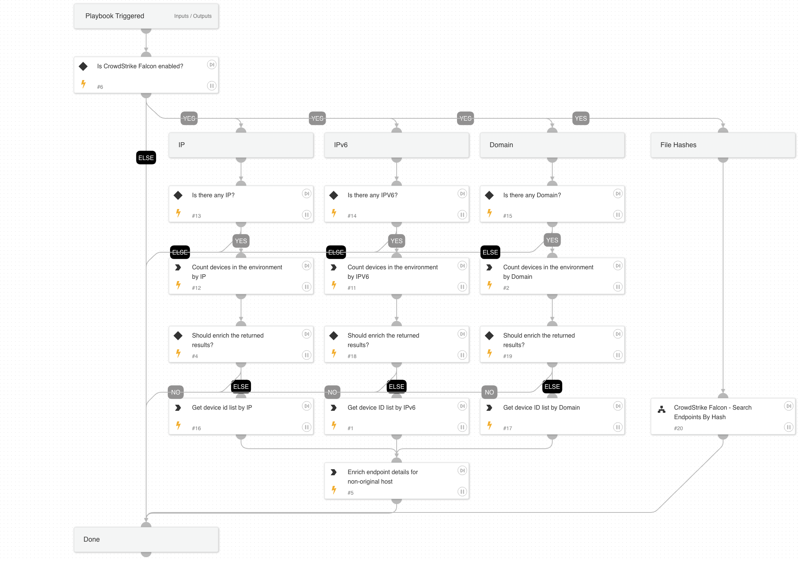

This playbooks searches for different indicators (IP,IPV6,File hashes,Domain) in the crowdstrike falcon console. The output will be all the endpoitns found associated with provided indicators. Provided agent id as an input will be excluded from the returned list.

## Dependencies

This playbook uses the following sub-playbooks, integrations, and scripts.

### Sub-playbooks

CrowdStrike Falcon - Search Endpoints By Hash

### Integrations

* CrowdStrikeFalcon
* CrowdstrikeFalcon

### Scripts

IsIntegrationAvailable

### Commands

* cs-falcon-device-count-ioc
* cs-falcon-device-ran-on
* endpoint

## Playbook Inputs

---

| **Name** | **Description** | **Default Value** | **Required** |
| --- | --- | --- | --- |
| FileSha256 | The SHA256 file hash to search for. |  | Optional |
| HostId | The host ID which will be excluded from the results. |  | Optional |
| SHA1 | The SHA1 file hash to search for. |  | Optional |
| MD5 | The MD5 file hash to search for. |  | Optional |
| IP | The IPV4 indicator to search for. | 8.8.8.8 | Optional |
| Domain | The Domain Indicator to search for. |  | Optional |
| IPV6 | The IPv6 Indicator to search for. |  | Optional |

## Playbook Outputs

---

| **Path** | **Description** | **Type** |
| --- | --- | --- |
| Endpoint | Additional hosts that have the hash present. | string |
| CrowdStrike.IOC.DeviceCount | The number of devices the IOC ran on. | number |
| Endpoint.Hostname | The endpoint's hostname. | unknown |
| CrowdStrike.IOC.Type | The type of the IOC. | unknown |
| Endpoint.IPAddress | The endpoint's IP address. | unknown |
| CrowdStrike.IOC.Value | The string representation of the indicator. | unknown |
| Endpoint.OS | The endpoint operation system. | unknown |
| Endpoint.Status | The endpoint status. | unknown |
| Endpoint.IsIsolated | The endpoint isolation status. | unknown |
| CrowdStrike.DeviceID | Device IDs an indicator ran on. | unknown |

## Playbook Image

---

