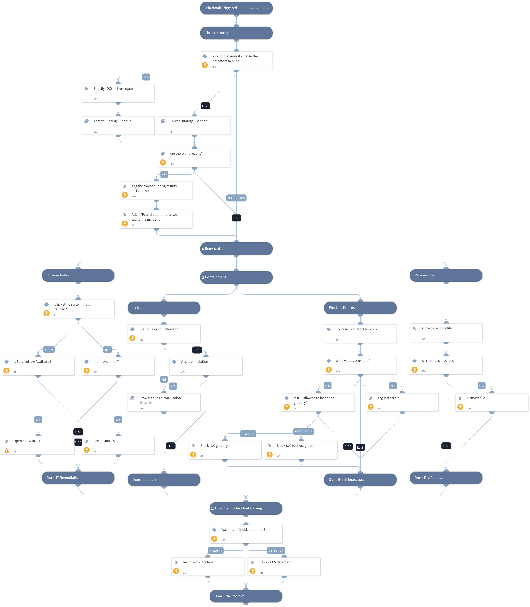

This playbook is part of the 'Malware Investigation And Response' pack. For more information, refer to https://xsoar.pan.dev/docs/reference/packs/malware-investigation-and-response. This playbook handles a CrowdStrike incident that was determined to be a true positive by the analyst. Actions include isolating the host, blocking the indicator by the EDR, and tagging it.

## Dependencies
This playbook uses the following sub-playbooks, integrations, and scripts.

### Sub-playbooks
* Threat Hunting - Generic
* Crowdstrike Falcon - Isolate Endpoint

### Integrations
CrowdStrikeFalcon

### Scripts
* AddEvidence
* IsIntegrationAvailable
* ServiceNowCreateIncident

### Commands
* setIndicators
* setIncident
* cs-falcon-resolve-incident
* cs-falcon-rtr-remove-file
* cs-falcon-resolve-detection
* jira-create-issue
* cs-falcon-upload-custom-ioc

## Playbook Inputs
---

| **Name** | **Description** | **Default Value** | **Required** |
| --- | --- | --- | --- |
| TicketingSystemToUse | The name of the ticketing system to use, for example Jira or ServiceNow. |  | Optional |
| BlockIOCTagName | The tag to assign for indicators to block. |  | Optional |
| HostID | The ID of the host to use. |  | Optional |
| AutoIsolation | Whether automatic host isolation is allowed. | false | Optional |
| TicketProjectName | The ticket project name \(required for Jira\). |  | Optional |
| BlockMaliciousIOCGlobally | Whether adding to the block list is global. If False, provide an input for the BlockHostGroup input with the group name. | True | Optional |
| BlockHostGroupName | The name of the allow list group to apply if BlockMaliciousIOCGlobally is set to False. |  | Optional |
| TicketDescription | The description to be used by the ticketing system. |  | Optional |
| CloseNotes | Provide the close notes to be listed in CrowdStrike. |  | Optional |
| Sha256 | The SHA256 value to manage. |  | Optional |
| PathsForFilesToRemove | Provide the path for the file to remove. |  | Optional |
| OperatingSystemToRemoveFrom | Values can be Windows, Linux, Mac. |  | Optional |
| ManuallyChooseIOCForHunting | This input will provide you with the ability to select IOCs to be hunted using the Threat Hunting - generic playbook. If false, it will hunt for all IOCs detected in the incident. Note: You can also insert "No Threat Hunting" to skip the Threat Hunting stage. | True | Optional |
| IP | IP value to hunt on. | IP | Optional |
| MD5 | MD5 file value to hunt upon. | File.MD5 | Optional |
| URL_or_Domain | URL or Domain to hunt upon. | Domain.Name | Optional |
| FileSha1 | File SHA1 value to hunt upon. | File.SHA1 | Optional |

## Playbook Outputs
---
There are no outputs for this playbook.

## Playbook Image
---

