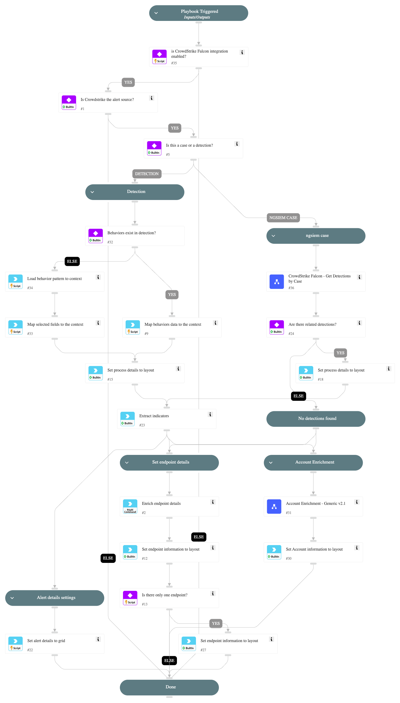

This playbook is part of the 'Malware Investigation And Response' pack. For more information, refer to https://xsoar.pan.dev/docs/reference/packs/malware-investigation-and-response.
This playbook enables enriching CrowdStrike Falcon incidents by pivoting to their detections as well as mapping all the relevant data to the Cortex XSOAR incident fields.

## Dependencies
This playbook uses the following sub-playbooks, integrations, and scripts.

### Sub-playbooks
CrowdStrike Falcon - Get Detections by Incident

### Integrations
CrowdStrikeFalcon

### Scripts
* SetGridField
* SetAndHandleEmpty
* isError

### Commands
* extractIndicators
* setIncident
* endpoint

## Playbook Inputs
---

| **Name** | **Description** | **Default Value** | **Required** |
| --- | --- | --- | --- |
| DetectionOrIncidentID | The ID of the CrowdStrike detection or incident. | ${incident.externalsystemid} | Optional |

## Playbook Outputs
---

| **Path** | **Description** | **Type** |
| --- | --- | --- |
| CrowdStrike | CrowdStrike Detection or Incident details. | unknown |
| Endpoint | Endpoint details. | unknown |
| CrowdStrike.FoundDetections | Indicates whether detections were found.  | string |

## Playbook Image
---
