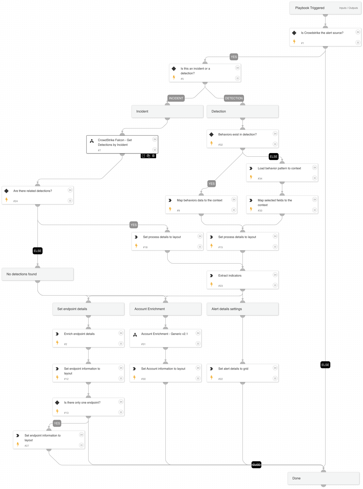

This playbook enables to enrich CrowdStrike Falcon incidents by pivoting to their detections as well as mapping all the relevant data to the XSOAR incident fields.

## Dependencies
This playbook uses the following sub-playbooks, integrations, and scripts.

### Sub-playbooks
* Crowdstrike Incident enrichment

### Integrations
* CrowdStrikeFalcon

### Scripts
* isError
* SetGridField
* SetAndHandleEmpty

### Commands
* setIncident
* endpoint

## Playbook Inputs
---

| **Name** | **Description** | **Default Value** | **Required** |
| --- | --- | --- | --- |
| DetectionOrIncidentID | The ID of the CrowdStrike detection or incident. | ${incident.externalsystemid} | Optional |

## Playbook Outputs
---

| **Path** | **Description** | **Type** |
| --- | --- | --- |
| CrowdStrike | CrowdStrike Detection or Incident details. | unknown | 
| Endpoint | Endpoint details. | unknown | 

## Playbook Image
---
