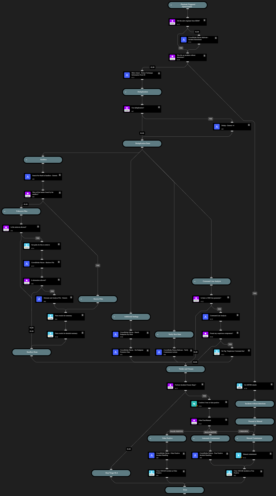

This playbook is part of the 'Malware Investigation And Response' pack. For more information, refer to https://xsoar.pan.dev/docs/reference/packs/malware-investigation-and-response.
This playbook covers a detailed flow of handling a CrowdStrike Falcon malware investigation, including:  
- Extracting and displaying MITRE data from the EDR and sandboxes
- Deduplicatimg similar incidents
- Searching for hashes in an alert in a sandbox to provide their relevant information. If the hashes are not found, retrieving them from the endpoint and detonating them in the sandbox.
- Verifying the actions taken by the EDR
- Analyzing the command line
- Searching for the relevant hashes in additional hosts in the organization
- Retrieving data about the host, including process list and network connections
- Performing containment and mitigation actions as part of handling false/true positives 
- Setting the relevant layouts

## Dependencies
This playbook uses the following sub-playbooks, integrations, and scripts.

### Sub-playbooks
* Crowdstrike Falcon - False Positive Incident Handling
* Retrieve Endpoint Forensics Data
* Dedup - Generic v4
* Search For Hash In Sandbox - Generic
* Detonate and Analyze File - Generic
* CrowdStrike Falcon Malware - Verify Containment Actions
* Mitre Attack - Extract Technique Information From ID
* CrowdStrike Falcon - Retrieve File
* CrowdStrike Falcon Malware - Incident Enrichment
* Command-Line Analysis
* CrowdStrike Falcon - Search Endpoints By Hash
* Crowdstrike Falcon - True Positive Incident Handling

### Integrations
This playbook does not use any integrations.

### Scripts
* InvestigationSummaryParse
* InvestigationDetailedSummaryParse
* SetAndHandleEmpty

### Commands
* closeInvestigation
* setIncident

## Playbook Inputs
---

| **Name** | **Description** | **Default Value** | **Required** |
| --- | --- | --- | --- |
| RetrieveFile | Whether file retrieval from the endpoint is allowed. | true | Optional |
| DetonateFile | Whether file detonation is allowed in the sandbox. | true | Optional |
| EnableDeduplication | Whether the deduplication playbook will be used. | false | Optional |
| EnableClosureSteps | Whether to close an incident using closure steps or to close automatically. | true | Optional |
| TicketingSystemToUse | The name of the ticketing system to use, for example Jira or ServiceNow. |  | Optional |
| BlockIOCTagName | The tag to assign for indicators to block. |  | Optional |
| AutoIsolation | Whether host isolation is allowed. | false | Optional |
| AllowIOCTagName | The name of the tag to apply for allowed indicators. |  | Optional |
| TicketProjectName | The ticket project name. (required for Jira). |  | Optional |
| AutoUnisolation | Whether automatic un-isolation is allowed. | false | Optional |
| DidAlertOriginateFromSIEM | Whether the alert originated from a SIEM. If True, the incident enrichment flow does not run. | false | Optional |
| DedupHandleSimilar | This input defines how to handle similar incidents.  Possible values:  Link Close Link and Close. Note: Closing incidents requires you to define the CloseSimilar input as well. Also, the incidents found by similar indicators or fields will be closed if their similarity score is above the CloseSimilar value.  | Link | Optional |
| DedupLimit | The maximum number of incidents to query and set to context data. | 200 | Optional |
| DedupCloseSimilar | Defines the threshold of similarity to close a similar incident. All similar incidents with similarity above this value will be closed.    For example, if CloseSimilar is set to .8 and an incident has a similarity score of .9, the incident will be closed. The value should be between 0 and 1 [0=low similarity , 1=identical]. |  | Optional |
| ApplyOCGlobally | Whether to apply the IOC globally. If False, set the HostGroupName input to the group name. | true | Optional |
| HostGroupName | The name of the list group to apply if ApplyOCGlobally is set to False. |  | Optional |
| DedupSimilarTextField | A comma-separated list of incident text fields to take into account when computing similarity. For example commandline, URL. | agnetsid,users,agentsid,CMDline,Hostnames,filenames,filepaths | Optional |
| DedupMinimunIncidentSimilarity | Retain incidents with a similarity score that's higher than the MinimunIncidentSimilarity. Value should be between 0 to 1 \[0=low similarity, 1=identical\] | 0.2 | Optional |

## Playbook Outputs
---

| **Path** | **Description** | **Type** |
| --- | --- | --- |
| CrowdStrike | All the CrowdStrike data | unknown |
| Endpoint | All the endpoint data | string |

## Playbook Image
---

