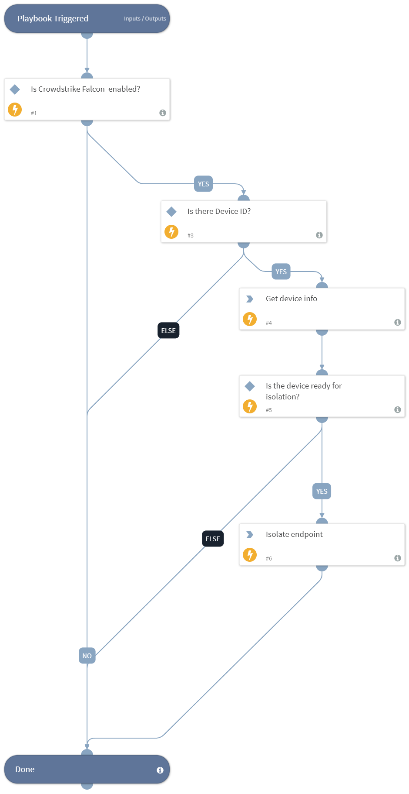

This playbook will auto isolate endpoints by the device ID that was provided in the playbook.

## Dependencies
This playbook uses the following sub-playbooks, integrations, and scripts.

### Sub-playbooks
This playbook does not use any sub-playbooks.

### Integrations
CrowdStrikeFalcon

### Scripts
IsIntegrationAvailable

### Commands
* cs-falcon-contain-host
* cs-falcon-search-device

## Playbook Inputs
---

| **Name** | **Description** | **Default Value** | **Required** |
| --- | --- | --- | --- |
| Device_id | The device ID to isolate. |  | Optional |

## Playbook Outputs
---
There are no outputs for this playbook.

## Playbook Image
---

