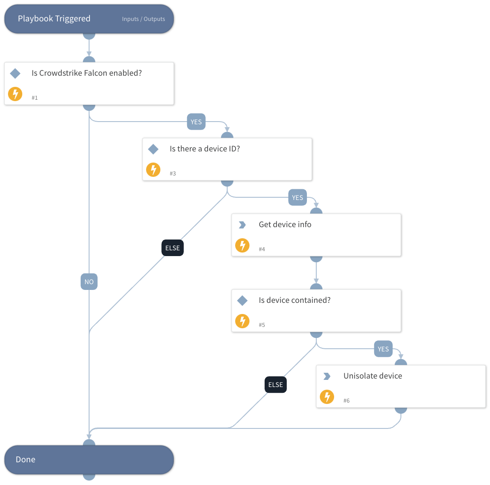

This playbook unisolates devices according to the device ID that is provided in the playbook input.

## Dependencies
This playbook uses the following sub-playbooks, integrations, and scripts.

### Sub-playbooks
This playbook does not use any sub-playbooks.

### Integrations
CrowdStrikeFalcon

### Scripts
IsIntegrationAvailable

### Commands
* cs-falcon-lift-host-containment
* cs-falcon-search-device

## Playbook Inputs
---

| **Name** | **Description** | **Default Value** | **Required** |
| --- | --- | --- | --- |
| Endpoint_id | The endpoint ID/device ID that you want to unisolate.  |  | Optional |

## Playbook Outputs
---
There are no outputs for this playbook.

## Playbook Image
---

