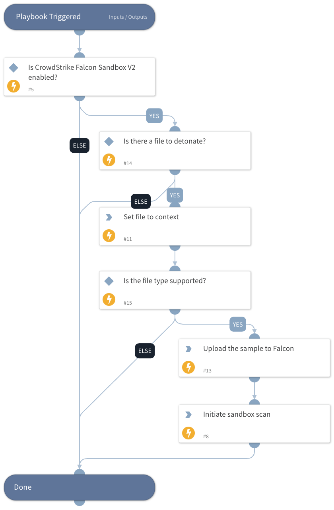

Detonates a File using CrowdStrike Falcon sandbox.

## Dependencies

This playbook uses the following sub-playbooks, integrations, and scripts.

### Sub-playbooks

This playbook does not use any sub-playbooks.

### Integrations

* CrowdStrikeFalconSandboxV2

### Scripts

* Set

### Commands

* cs-falcon-sandbox-scan
* cs-falcon-sandbox-submit-sample

## Playbook Inputs

---

| **Name** | **Description** | **Default Value** | **Required** |
| --- | --- | --- | --- |
| File | The file object of the file to detonate. | File | Optional |
| EnvironmentID | The environment ID where the file should be submitted. To retrieve all available IDs, please execute the crowdstrike-get-environments command. | 100 | Optional |

## Playbook Outputs

---

| **Path** | **Description** | **Type** |
| --- | --- | --- |
| File.SHA256 | The SHA256 hash of the file. | string |
| File.Malicious | The file malicious description. | unknown |
| File.Type | The file type, for example "PE". | string |
| File.Size | The file size. | number |
| File.MD5 | The MD5 hash of the file. | string |
| File.Name | The file name. | string |
| File.SHA1 | The SHA1 hash of the file. | string |
| File | The file object. | unknown |
| File.Malicious.Vendor | The vendor that decided the file was malicious. | string |
| DBotScore | The DBotScore object. | unknown |
| DBotScore.Indicator | The tested indicator. | string |
| DBotScore.Type | The indicator type. | string |
| DBotScore.Vendor | The vendor used to calculate the score. | string |
| DBotScore.Score | The actual score. | number |

## Playbook Image

---

