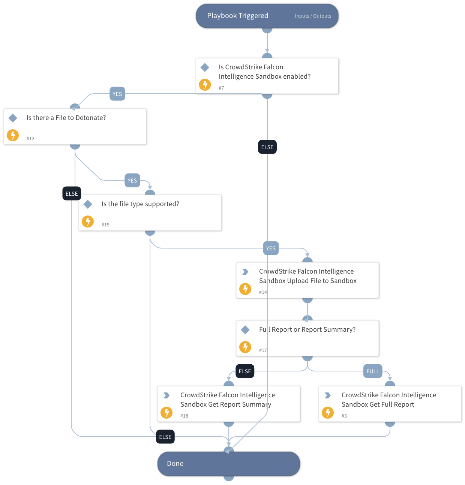

Detonates a file using CrowdStrike Falcon Intelligence Sandbox.
Accepted file formats:
Portable executables: .exe, .scr, .pif, .dll, .com, .cpl, etc.
Office documents: .doc, .docx, .ppt, .pps, .pptx, .ppsx, .xls, .xlsx, .rtf, .pub
PDF
APK
Executable JAR
Windows script component: .sct
Windows shortcut: .lnk
Windows help: .chm
HTML application: .hta
Windows script file: .wsf
Javascript: .js
Visual Basic: .vbs, .vbe
Shockwave Flash: .swf
Perl: .pl
Powershell: .ps1, .psd1, .psm1
Scalable vector graphics: .svg
Python: .py
Linux ELF executables
Email files: MIME RFC 822 .eml, Outlook .msg.

## Dependencies

This playbook uses the following sub-playbooks, integrations, and scripts.

### Sub-playbooks

This playbook does not use any sub-playbooks.

### Integrations

* CrowdStrikeFalconX
* CrowdStrike Falcon X

### Scripts

This playbook does not use any scripts.

### Commands

* cs-fx-get-report-summary
* cs-fx-upload-file
* cs-fx-get-full-report

## Playbook Inputs

---

| **Name** | **Description** | **Default Value** | **Required** |
| --- | --- | --- | --- |
| File | The file to detonate. The file is taken from the context. | File | Optional |
| Interval | Polling frequency - how often the polling command should run \(in minutes\). | 1 | Optional |
| Timeout | How much time to wait before a timeout occurs \(in minutes\). | 10 | Optional |
| EnvironmentID | Sandbox environment used for analysis. | 160: Windows 10 | Optional |
| ActionScript | Runtime script for sandbox analysis. |  | Optional |
| CommandLine | Command line script passed to the submitted file at runtime. Max length: 2048 characters. |  | Optional |
| DocumentPassword | Auto-filled for Adobe or Office files that prompt for a password. Max length: 32 characters. |  | Optional |
| SubmitName | Name of the malware sample that's used for file type detection and analysis. |  | Optional |
| SystemDate | Set a custom date for the sandbox environment in the format yyyy-MM-dd. |  | Optional |
| SystemTime | Sets a custom time for the sandbox environment in the format HH:mm. |  | Optional |
| FullReport | Whether to get a full report or report summary from Falcon X. Set to "False" to get report summary. | True | Optional |

## Playbook Outputs

---

| **Path** | **Description** | **Type** |
| --- | --- | --- |
| csfalconx.resource.id | Analysis ID. | String |
| csfalconx.resource.verdict | Analysis verdict. | String |
| csfalconx.resource.created_timestamp | Analysis start time. | String |
| csfalconx.resource.environment_id | Environment ID. | String |
| csfalconx.resource.snadbox.environment_description | Environment description. | String |
| csfalconx.resource.threat_score | Score of the threat. | Int |
| csfalconx.resource.submit_url | URL submitted for analysis. | String |
| csfalconx.resource.submission_type | Type of submitted artifact, for example file, URL, etc. | String |
| csfalconx.resource.filetype | File type. | String |
| csfalconx.resource.filesize | File size. | Int |
| csfalconx.resource.sha256 | SHA256 hash of the submitted file. | String |
| csfalconx.resource.ioc_report_strict_csv_artifact_id | ID of the IOC pack to download \(CSV\). | String |
| csfalconx.resource.ioc_report_broad_csv_artifact_id | ID of the IOC pack to download \(CSV\). | String |
| csfalconx.resource.ioc_report_strict_json_artifact_id | ID of the IOC pack to download \(JSON\). | Int |
| csfalconx.resource.ioc_report_broad_json_artifact_id | ID of the IOC pack to download \(JSON\). | String |
| csfalconx.resource.ioc_report_strict_stix_artifact_id | ID of the IOC pack to download \(STIX\). | String |
| csfalconx.resource.ioc_report_broad_stix_artifact_id | ID of the IOC pack to download \(STIX\). | Int |
| csfalconx.resource.ioc_report_strict_maec_artifact_id | ID of the IOC pack to download \(MAEC\). | String |
| csfalconx.resource.ioc_report_broad_maec_artifact_id | ID of the IOC pack to download \(MAEC\). | String |

## Playbook Image

---

