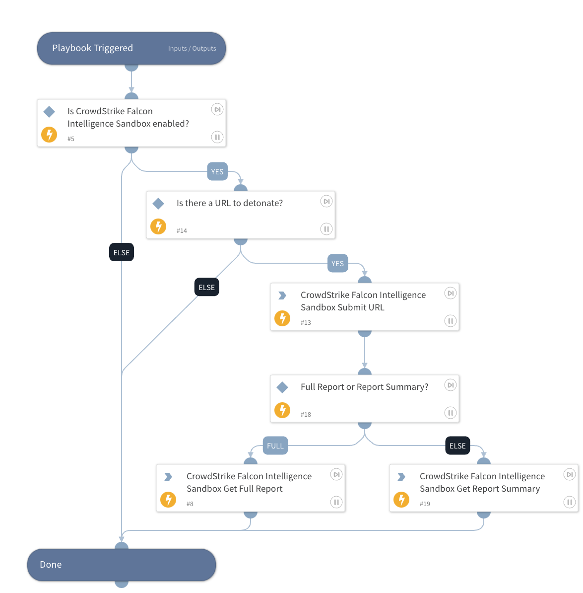

Detonate one or more URLs using the CrowdStrike Falcon Intelligence Sandbox integration. This playbook returns relevant reports to the War Room and file reputations to the context data.

## Dependencies

This playbook uses the following sub-playbooks, integrations, and scripts.

### Sub-playbooks

This playbook does not use any sub-playbooks.

### Integrations

* CrowdStrike Falcon X
* CrowdStrikeFalconX

### Scripts

This playbook does not use any scripts.

### Commands

* cs-fx-get-report-summary
* cs-fx-get-full-report
* cs-fx-submit-url

## Playbook Inputs

---

| **Name** | **Description** | **Default Value** | **Required** |
| --- | --- | --- | --- |
| URL | URL to detonate. | URL.Data | Optional |
| Interval | Polling frequency - how often the polling command should run \(in minutes\). | 1 | Optional |
| Timeout | How much time to wait before a timeout occurs  \(in minutes\). | 10 | Optional |
| Full Report | Whether to get a full report or report summary from Falcon X. Set to "False" to get report summary. | True | Optional |

## Playbook Outputs

---

| **Path** | **Description** | **Type** |
| --- | --- | --- |
| csfalconx.resource.id | Analysis ID. | String |
| csfalconx.resource.verdict | Analysis verdict. | String |
| csfalconx.resource.created_timestamp | Analysis start time. | String |
| csfalconx.resource.environment_id | Environment ID. | String |
| csfalconx.resource.environment_description | Environment description. | String |
| csfalconx.resource.threat_score | Score of the threat. | Int |
| csfalconx.resource.submit_url | URL submitted for analysis. | String |
| csfalconx.resource.submission_type | Type of submitted artifact, for example file, URL, etc. | String |
| csfalconx.resource.sha256 | SHA256 hash of the submitted file. | String |
| csfalconx.resource.ioc_report_strict_csv_artifact_id | ID of the IOC pack to download \(CSV\). | String |
| csfalconx.resource.ioc_report_broad_csv_artifact_id | ID of the IOC pack to download \(CSV\). | String |
| csfalconx.resource.ioc_report_strict_json_artifact_id | ID of the IOC pack to download \(JSON\). | Int |
| csfalconx.resource.ioc_report_broad_json_artifact_id | ID of the IOC pack to download \(JSON\). | String |
| csfalconx.resource.ioc_report_strict_stix_artifact_id | ID of the IOC pack to download \(STIX\). | String |
| csfalconx.resource.ioc_report_broad_stix_artifact_id | ID of the IOC pack to download \(STIX\). | Int |
| csfalconx.resource.ioc_report_strict_maec_artifact_id | ID of the IOC pack to download \(MAEC\). | String |
| csfalconx.resource.ioc_report_broad_maec_artifact_id | ID of the IOC pack to download \(MAEC\). | String |

## Playbook Image

---

