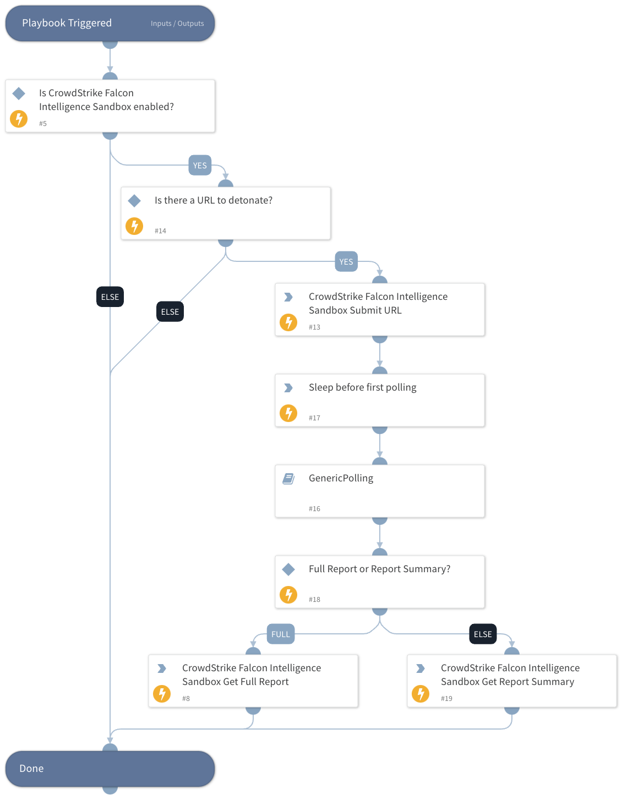

This playbook uploads, detonates, and analyzes URLs for the CrowdStrike Falcon Intelligence Sandbox.

## Dependencies

This playbook uses the following sub-playbooks, integrations, and scripts.

### Sub-playbooks

This playbook does not use any sub-playbooks.

### Integrations

* CrowdStrikeFalconX

### Scripts

* IsIntegrationAvailable

### Commands

* cs-fx-submit-url

## Playbook Inputs

---

| **Name** | **Description** | **Default Value** | **Required** |
| --- | --- | --- | --- |
| URL | The details of the URL to detonate. |  | Optional |
| AlertOS | The operating system for which the alert was raised. accepted values are Windows, Linux, Android | ${incident.deviceosname} | Optional |
| EnableTor | Whether the sandbox analysis routes network traffic via TOR. If true, sandbox analysis routes network traffic via TOR. Relevant if the submit_file parameter is set to true. | false | Optional |
| EnvironmentID | Sandbox environment used for analysis. | '160: Windows 10' | Optional |
| ActionScript | Runtime script for sandbox analysis. |  | Optional |
| CommandLine | Command line script passed to the submitted file at runtime. Max length: 2048 characters. |  | Optional |
| DocumentPassword | Auto-filled for Adobe or Office files that prompt for a password. Max length: 32 characters. |  | Optional |
| SubmitName | Name of the malware sample that’s used for file type detection. and analysis. |  | Optional |
| SystemDate | Set a custom date for the sandbox environment in the format yyyy-MM-dd. |  | Optional |
| SystemTime | Sets a custom time for the sandbox environment in the format HH:mm. |  | Optional |

## Playbook Outputs

---

| **Path** | **Description** | **Type** |
| --- | --- | --- |
| DBotScore | The Dbot Score of the analyzed URL | unknown |
| csfalconx.resource | URL analysis report info | unknown |
| csfalconx.resource.sandbox.http_requests | URL analysis report info | unknown |
| csfalconx.resource.sandbox | URL analysis report info | unknown |
| csfalconx.resource.sandbox.processes | URL analysis report info | unknown |
| csfalconx.resource.sandbox.processes.handles | URL analysis report info | unknown |
| csfalconx.resource.sandbox.extracted_files | URL analysis report info | unknown |
| csfalconx.resource.sandbox.file_metadata | URL analysis report info | unknown |
| csfalconx.resource.sandbox.dns_requests | URL analysis report info | unknown |
| csfalconx.resource.sandbox.contacted_hosts | URL analysis report info | unknown |
| csfalconx.resource.sandbox.contacted_hosts.associated_runtime | URL analysis report info | unknown |
| csfalconx.resource.sandbox.mitre_attacks | URL analysis report info | unknown |
| csfalconx.resource.sandbox.mitre_attacks.parent | URL analysis report info | unknown |
| csfalconx.resource.sandbox.signatures | URL analysis report info | unknown |
| csfalconx.resource.intel | URL analysis report info | unknown |

## Playbook Image

---

