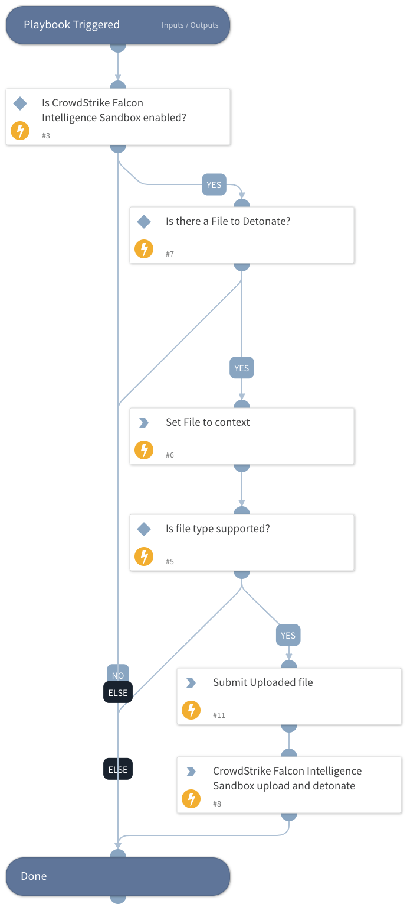

This playbook uploads, detonates, and analyzes files for the CrowdStrike Falcon Intelligence Sandbox.

## Dependencies
This playbook uses the following sub-playbooks, integrations, and scripts.

### Sub-playbooks
This playbook does not use any sub-playbooks.

### Integrations
* CrowdStrikeFalconIntelligenceSandbox

### Scripts
* IsIntegrationAvailable
* Set

### Commands
* cs-fx-upload-file
* cs-fx-submit-uploaded-file

## Playbook Inputs
---

| **Name** | **Description** | **Default Value** | **Required** |
| --- | --- | --- | --- |
| File | The details of the file to detonate. |  | Optional |
| AlertOS | The operating system for which the alert was raised. Possible values: * Windows * Linux * Android | ${incident.deviceosname} | Optional |

## Playbook Outputs
---

| **Path** | **Description** | **Type** |
| --- | --- | --- |
| csfalconx.resource.tags | The analysis tags. | unknown |
| csfalconx.resource.sha256 | The SHA256 hash of the scanned file. | unknown |
| csfalconx.resource.file_name | The name of the uploaded file.  | unknown |
| csfalconx.resource.sandbox | The Falcon Intelligence Sandbox findings results. | unknown |
| csfalconx.resource.intel | The Falcon Intelligence Sandbox intelligence results. | unknown |

## Playbook Image
---

