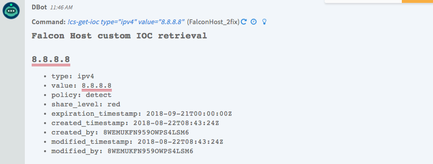
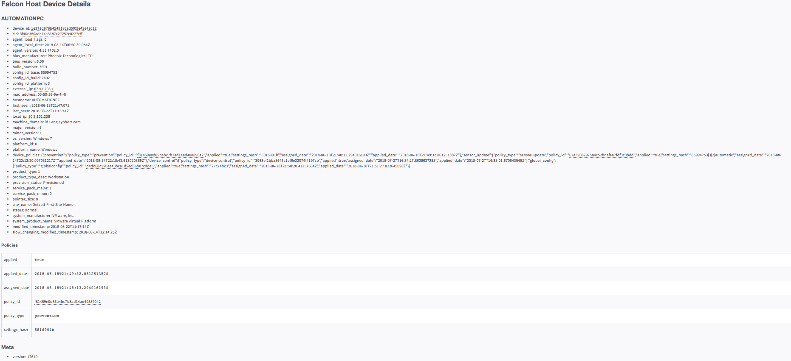
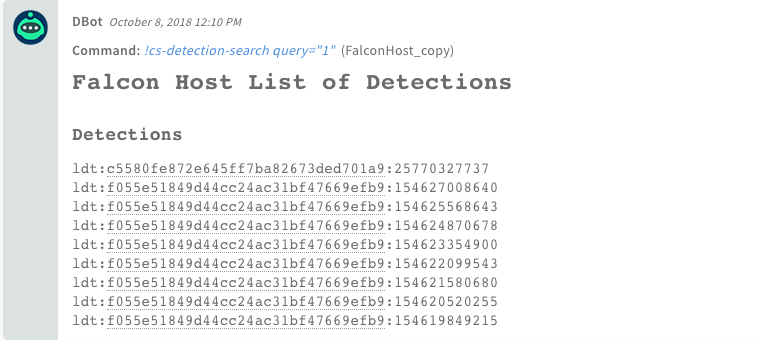

<!-- HTML_DOC -->
<h2> </h2>

Use the CrowdStrike Falcon Host integration to detect and block malicious activity.

 

<h2>Configure CrowdStrike Falcon Host Integration on Cortex XSOAR</h2>
<ol>
<li>Navigate to <strong>Settings</strong> &gt; <strong>Integrations</strong> &gt; <strong>Servers &amp; Services</strong>.</li>
<li>Search for FalconHost.</li>
<li>Click <strong>Add instance</strong> to create and configure a new integration instance. 
<ul>
<li>
<strong>Name</strong>: a textual name for the integration instance.</li>
<li><strong>Server URL (e.g. <a href="https://192.168.0.1/" rel="nofollow">https://192.168.0.1</a>)</strong></li>
<li><strong>API ID</strong></li>
<li><strong>API Key</strong></li>
<li><strong>Use system proxy settings</strong></li>
<li><strong>Allow self-signed SSL certificates</strong></li>
</ul>
</li>
<li>Click <strong>Test</strong> to validate the URLs, token, and connection.</li>
</ol>

 

<h2>Commands</h2>

You can execute these commands from the Cortex XSOAR CLI, as part of an automation, or in a playbook. After you successfully execute a command, a DBot message appears in the War Room with the command details.

<ol>
<li><a href="#h_91950037141535449351719">Upload indicators for CS to monitor: cs-upload-ioc</a></li>
<li><a href="#h_595229102941535449358310">Get definitions of monitored indicators: cs-get-ioc</a></li>
<li><a href="#h_6689032821831535449367661">Update indicators: cs-update-ioc</a></li>
<li><a href="#h_9452354952711535449374480">Delete an indicator: cs-delete-ioc</a></li>
<li><a href="#h_2223791593581535449380302">Get a list of uploaded IOCs: cs-search-iocs</a></li>
<li><a href="#h_496752194441535449754930">Search for devices: cs-device-search</a></li>
<li><a href="#h_387520955301535449766860">Get device details: cs-device-details</a></li>
<li><a href="#h_4217399986151535449774372">Get the number of devices an IOC ran on: cs-device-count-ioc</a></li>
<li><a href="#h_892938226971535449786604">Get a list of device IDs that an indicator ran on: cs-device-ran-on</a></li>
<li><a href="#h_5200099537791535449799102">Get the process ID of an indicator for a device: cs-processes-ran-on</a></li>
<li><a href="#h_4308472088591535449812936">Get process details: cs-process-details</a></li>
<li><a href="#h_5282539089371535449827674">Set resolution status: cs-resolve-detection (Deprecated)</a></li>
<li><a href="#h_85888761731538978740367">Search all detection fields: cs-detection-search (Deprecated)</a></li>
<li><a href="#h_2636367141621538978747829">Get detection details: cs-detection-details (Deprecated)</a></li>
</ol>
<h3 id="h_91950037141535449351719">1. Upload indicators for CS to monitor</h3>

Uploads one or more indicators for CrowdStrike to monitor.

<h5>Base Command</h5>

<code>cs-upload-ioc</code>

<h5>Input</h5>
<table style="width: 748px;" border="2" cellpadding="6">
<thead>
<tr>
<th style="width: 132px;"><strong>Argument Name</strong></th>
<th style="width: 505px;"><strong>Description</strong></th>
<th style="width: 71px;"><strong>Required</strong></th>
</tr>
</thead>
<tbody>
<tr>
<td style="width: 132px;">type</td>
<td style="width: 505px;">The type of the indicator</td>
<td style="width: 71px;">Required</td>
</tr>
<tr>
<td style="width: 132px;">value</td>
<td style="width: 505px;">The string representation of the indicator</td>
<td style="width: 71px;">Required</td>
</tr>
<tr>
<td style="width: 132px;">policy</td>
<td style="width: 505px;">The policy to enact when the value is detected on a host. A value of <em>none</em> is equivalent to turning the indicator off.</td>
<td style="width: 71px;">Optional</td>
</tr>
<tr>
<td style="width: 132px;">share_level</td>
<td style="width: 505px;">The level at which the indicator will be shared. Only red share level (not shared) is supported, which indicates that the IOC is not shared with other Falcon Host customers.</td>
<td style="width: 71px;">Optional</td>
</tr>
<tr>
<td style="width: 132px;">expiration_days</td>
<td style="width: 505px;">The days the indicator is be valid for. This only applies to domain, IPv4, and IPv6 types. Default is 30.</td>
<td style="width: 71px;">Optional</td>
</tr>
<tr>
<td style="width: 132px;">source</td>
<td style="width: 505px;">The source where this indicator originated. This can be used for tracking where this indicator was defined. Limit 200 characters.</td>
<td style="width: 71px;">Optional</td>
</tr>
<tr>
<td style="width: 132px;">description</td>
<td style="width: 505px;">A meaningful description of the indicator. Limit 200 characters.</td>
<td style="width: 71px;">Optional</td>
</tr>
</tbody>
</table>
<h5> </h5>
<h5>Context Output</h5>

There is no context output for this command.

<h5>Command Example</h5>

<code>!cs-upload-ioc type=ipv4 value=8.8.8.8</code>

<h5>Human Readable Output</h5>

<h3 id="h_595229102941535449358310">2. Get definitions of monitored indicators</h3>

Get the full definition of one or more indicators that you are watching

<h5>Base Command</h5>

<code>cs-get-ioc</code>

<h5>Input</h5>
<table style="width: 750px;" border="2" cellpadding="6">
<thead>
<tr>
<th><strong>Argument Name</strong></th>
<th><strong>Description</strong></th>
<th><strong>Required</strong></th>
</tr>
</thead>
<tbody>
<tr>
<td>type</td>
<td>The IOC type to retrieve</td>
<td>Required</td>
</tr>
<tr>
<td>value</td>
<td>The IOC value to retrieve</td>
<td>Required</td>
</tr>
</tbody>
</table>
<h5> </h5>
<h5>Context Output</h5>

There is no context output for this command.

<h5>Command Example</h5>

<code>!cs-get-ioc type=ipv4 value=8.8.8.8</code>

<h5>Human Readable Output</h5>

<h3 id="h_6689032821831535449367661">3. Update indicators</h3>

Updates one or more of the uploaded indicators.

<h5>Base Command</h5>

<code>cs-update-ioc</code>

<h5>Input</h5>
<table style="width: 748px;" border="2" cellpadding="6">
<thead>
<tr>
<th style="width: 133px;"><strong>Argument Name</strong></th>
<th style="width: 504px;"><strong>Description</strong></th>
<th style="width: 71px;"><strong>Required</strong></th>
</tr>
</thead>
<tbody>
<tr>
<td style="width: 133px;">type</td>
<td style="width: 504px;">The IOC type to update</td>
<td style="width: 71px;">Required</td>
</tr>
<tr>
<td style="width: 133px;">value</td>
<td style="width: 504px;">The IOC value to update</td>
<td style="width: 71px;">Required</td>
</tr>
<tr>
<td style="width: 133px;">policy</td>
<td style="width: 504px;">The policy to enact when the value is detected on a host. A value of <em>none</em> is equivalent to turning the indicator off.</td>
<td style="width: 71px;">Optional</td>
</tr>
<tr>
<td style="width: 133px;">share_level</td>
<td style="width: 504px;">The level at which the indicator will be shared. Only red share level (not shared) is supported, which indicates that the IOC is not shared with other Falcon Host customers.</td>
<td style="width: 71px;">Optional</td>
</tr>
<tr>
<td style="width: 133px;">expiration_days</td>
<td style="width: 504px;">The days the indicator is be valid for. This only applies to domain, IPv4, and IPv6 types. Default is 30.</td>
<td style="width: 71px;">Optional</td>
</tr>
<tr>
<td style="width: 133px;">source</td>
<td style="width: 504px;">The source where this indicator originated. This can be used to track where this indicator was defined. Limit 200 characters.</td>
<td style="width: 71px;">Optional</td>
</tr>
<tr>
<td style="width: 133px;">description</td>
<td style="width: 504px;">A meaningful description of the indicator. Limit 200 characters.</td>
<td style="width: 71px;">Optional</td>
</tr>
</tbody>
</table>
<h5> </h5>
<h5>Context Output</h5>

There is no context output for this command.

<h5>Command Example</h5>

<code>!cs-update-ioc type=ipv4 value=8.8.8.8 policy=none</code>

<h5>Human Readable Output</h5>

<h3 id="h_9452354952711535449374480">4. Delete an indicator</h3>

Deletes an indicator that you are monitoring.

<h5>Base Command</h5>

<code>cs-delete-ioc</code>

<h5>Input</h5>
<table style="width: 750px;" border="2" cellpadding="6">
<thead>
<tr>
<th><strong>Argument Name</strong></th>
<th><strong>Description</strong></th>
<th><strong>Required</strong></th>
</tr>
</thead>
<tbody>
<tr>
<td>type</td>
<td>The IOC type to delete</td>
<td>Required</td>
</tr>
<tr>
<td>value</td>
<td>The IOC value to delete</td>
<td>Optional</td>
</tr>
</tbody>
</table>
<h5> </h5>
<h5>Context Output</h5>

There is no context output for this command.

<h5>Command Example</h5>

<code>!cs-delete-ioc type=ipv4 value=8.8.8.8</code>

<h5>Human Readable Output</h5>

<h3 id="h_2223791593581535449380302">5. Get a list of uploaded IOCs</h3>

Returns a list of your uploaded IOCs that match the search criteria.

<h5>Base Command</h5>

<code>cs-search-iocs</code>

<h5>Input</h5>
<table style="width: 750px;" border="2" cellpadding="6">
<thead>
<tr>
<th><strong>Argument Name</strong></th>
<th><strong>Description</strong></th>
<th><strong>Required</strong></th>
</tr>
</thead>
<tbody>
<tr>
<td>types</td>
<td>A list of indicator types. Separate multiple types by comma. Valid types are sha256, sha1, md5, domain, ipv4, ipv6.</td>
<td>Optional</td>
</tr>
<tr>
<td>values</td>
<td>Comma-separated list of indicator values</td>
<td>Optional</td>
</tr>
<tr>
<td>policies</td>
<td>Comma-separated list of indicator policies</td>
<td>Optional</td>
</tr>
<tr>
<td>share_levels</td>
<td>A list of share levels. Only red is supported.</td>
<td>Optional</td>
</tr>
<tr>
<td>sources</td>
<td>Comma-separated list of IOC sources</td>
<td>Optional</td>
</tr>
<tr>
<td>from_expiration_date</td>
<td>Start of date range to search (YYYY-MM-DD format)</td>
<td>Optional</td>
</tr>
<tr>
<td>to_expiration_date</td>
<td>End of date range to search (YYYY-MM-DD format)</td>
<td>Optional</td>
</tr>
<tr>
<td>sort</td>
<td>The order of the results. Format is <em>field.asc</em> or <em>field.desc</em>.</td>
<td>Optional</td>
</tr>
<tr>
<td>limit</td>
<td>The maximum number of records to return. The minimum is 1 and the maximum is 500. Default is 100.</td>
<td>Optional</td>
</tr>
<tr>
<td>offset</td>
<td>The offset to begin the list from. For example, start from the 10th record and return the list. Default is 0.</td>
<td>Optional</td>
</tr>
</tbody>
</table>
<h5> </h5>
<h5>Context Output</h5>

There is no context output for this command.

<h5>Command Example</h5>

<code>!cs-search-iocs types=domain !cs-search-iocs types=ipv4</code>

<h5>Human Readable Output</h5>

<h3 id="h_496752194441535449754930">6. Search for devices</h3>

Search for devices in your environment by platform, host name, IP, or various other parameters.

<h5>Base Command</h5>

<code>cs-device-search</code>

<h5>Input</h5>
<table style="width: 742px;" border="2" cellpadding="6">
<thead>
<tr>
<th style="width: 132px;"><strong>Argument Name</strong></th>
<th style="width: 505px;"><strong>Description</strong></th>
<th style="width: 71px;"><strong>Required</strong></th>
</tr>
</thead>
<tbody>
<tr>
<td style="width: 132px;">query</td>
<td style="width: 505px;">Search for a value across all fields</td>
<td style="width: 71px;">Optional</td>
</tr>
<tr>
<td style="width: 132px;">filter</td>
<td style="width: 505px;">Filter devices using query syntax of "field:value+field:value" where string values are enclosed in single quotes or as arrays in single quotes (['x', 'y']). Numerical fields and dates also support operators like field:&gt;value. For a list of relevant fields, see the CrowdStrike documentation.</td>
<td style="width: 71px;">Optional</td>
</tr>
<tr>
<td style="width: 132px;">limit</td>
<td style="width: 505px;">Number of results to return</td>
<td style="width: 71px;">Optional</td>
</tr>
<tr>
<td style="width: 132px;">offset</td>
<td style="width: 505px;">The result to start from</td>
<td style="width: 71px;">Optional</td>
</tr>
</tbody>
</table>
<h5> </h5>
<h5>Context Output</h5>
<table style="width: 750px;" border="2" cellpadding="6">
<thead>
<tr>
<th><strong>Path</strong></th>
<th><strong>Description</strong></th>
</tr>
</thead>
<tbody>
<tr>
<td>FalconHostDevices</td>
<td>Device IDs found by device search</td>
</tr>
</tbody>
</table>
<h5> </h5>
<h5>Command Example</h5>

<code>!cs-device-search limit=2 !cs-device-search</code>

<h5>Human Readable Output</h5>

<h3 id="h_387520955301535449766860">7. Get device details</h3>

Get details for one or more devices, according to device ID.

<h5>Base Command</h5>

<code>cs-device-details</code>

<h5>Input</h5>
<table style="width: 750px;" border="2" cellpadding="6">
<thead>
<tr>
<th><strong>Argument Name</strong></th>
<th><strong>Description</strong></th>
<th><strong>Required</strong></th>
</tr>
</thead>
<tbody>
<tr>
<td>ids</td>
<td>The ID of the process. Allows multiple values separated by comma.</td>
<td>Required</td>
</tr>
</tbody>
</table>
<h5>Context Output</h5>
<table style="width: 750px;" border="2" cellpadding="6">
<thead>
<tr>
<th><strong>Path</strong></th>
<th><strong>Type</strong></th>
<th><strong>Description</strong></th>
</tr>
</thead>
<tbody>
<tr>
<td>FalconHostDetails</td>
<td>string</td>
<td>The ID to retrieve details for. Supports comma-separated list of IDs.</td>
</tr>
<tr>
<td>Endpoint.ID</td>
<td>string</td>
<td>Unique ID of the endpoint in FalconHost</td>
</tr>
<tr>
<td>Endpoint.IPAddress</td>
<td>string</td>
<td>IPAddress of the endpoint</td>
</tr>
<tr>
<td>Endpoint.Domain</td>
<td>string</td>
<td>Domain of the endpoint</td>
</tr>
<tr>
<td>Endpoint.MACAddress</td>
<td>string</td>
<td>MAC address of the endpoint</td>
</tr>
<tr>
<td>Endpoint.OS</td>
<td>string</td>
<td>OS of the endpoint</td>
</tr>
<tr>
<td>Endpoint.OSVersion</td>
<td>string</td>
<td>OS version of the endpoint</td>
</tr>
<tr>
<td>Endpoint.BIOSVersion</td>
<td>string</td>
<td>BIOS version of the endpoint</td>
</tr>
<tr>
<td>Endpoint.HostName</td>
<td>string</td>
<td>The host of the endpoint</td>
</tr>
</tbody>
</table>
<h5> </h5>
<h5>Command Example</h5>

<code>!cs-device-details ids=1e371d976b4549186ed5f09e49e49c12 !cs-device-details ids=${FalconHostDevices}<code></code></code>

<h5>Context Example</h5>

<h5>Human Readable Output</h5>

<h3 id="h_4217399986151535449774372">8. Get the number of devices an IOC ran on</h3>

Returns the number of devices on which an IOC ran, according to type and value of an IOC

<h5>Base Command</h5>

<code>cs-device-count-ioc</code>

<h5>Input</h5>
<table style="width: 750px;" border="2" cellpadding="6">
<thead>
<tr>
<th><strong>Argument Name</strong></th>
<th><strong>Description</strong></th>
<th><strong>Required</strong></th>
</tr>
</thead>
<tbody>
<tr>
<td>type</td>
<td>The type of indicator</td>
<td>Required</td>
</tr>
<tr>
<td>value</td>
<td>The actual string representation of the indicator</td>
<td>Required</td>
</tr>
</tbody>
</table>
<h5> </h5>
<h5>Context Output</h5>

There is no context output for this command.

<h5>Command Example</h5>

<code>!cs-device-count-ioc type=sha1 value=f28c592833f234c619917b5c7d8974840a810247 !cs-device-count-ioc type=domain value=7.tw</code>

<h3 id="h_892938226971535449786604">9. Get a list of device IDs that an indicator ran on</h3>

Returns a list of device IDs on which an indicator ran

<h5>Base Command</h5>

<code>cs-device-ran-on</code>

<h5>Input</h5>
<table style="width: 750px;" border="2" cellpadding="6">
<thead>
<tr>
<th><strong>Argument Name</strong></th>
<th><strong>Description</strong></th>
<th><strong>Required</strong></th>
</tr>
</thead>
<tbody>
<tr>
<td>type</td>
<td>The type of indicator from the list of supported indicator types.</td>
<td>Required</td>
</tr>
<tr>
<td>value</td>
<td>The actual string representation of the indicator</td>
<td>Required</td>
</tr>
</tbody>
</table>
<h5> </h5>
<h5>Context Output</h5>
<table style="width: 750px;" border="2" cellpadding="6">
<thead>
<tr>
<th><strong>Path</strong></th>
<th><strong>Description</strong></th>
</tr>
</thead>
<tbody>
<tr>
<td>FalconHostDevices</td>
<td>Device IDs found by device IOC search</td>
</tr>
</tbody>
</table>
<h5> </h5>
<h5>Command Example</h5>

<code>!cs-device-ran-on type=sha1 value=f28c592833f234c619917b5c7d8974840a810247 !cs-device-ran-on type=domain value=7.tw</code>

<h3 id="h_5200099537791535449799102">10. Get the process ID of an indicator for a device</h3>

Returns the process ID of the indicator if it ran on given device recently

<h5>Base Command</h5>

<code>cs-processes-ran-on</code>

<h5>Input</h5>
<table style="width: 750px;" border="2" cellpadding="6">
<thead>
<tr>
<th><strong>Argument Name</strong></th>
<th><strong>Description</strong></th>
<th><strong>Required</strong></th>
</tr>
</thead>
<tbody>
<tr>
<td>type</td>
<td>The type of indicator from the list of supported indicator types.</td>
<td>Required</td>
</tr>
<tr>
<td>value</td>
<td>The actual string representation of the indicator</td>
<td>Required</td>
</tr>
<tr>
<td>device_id</td>
<td>The device ID you want to check against</td>
<td>Required</td>
</tr>
</tbody>
</table>
<h5> </h5>
<h5>Context Output</h5>
<table style="width: 750px;" border="2" cellpadding="6">
<thead>
<tr>
<th><strong>Path</strong></th>
<th><strong>Description</strong></th>
</tr>
</thead>
<tbody>
<tr>
<td>FalconHostProcesses</td>
<td>List of processes of the searched indicators</td>
</tr>
</tbody>
</table>
<h3> </h3>
<h3 id="h_4308472088591535449812936">11. Get process details</h3>

Retrieves the details of a process, according to process ID, that is running or that previously ran.

<h5>Base Command</h5>

<code>cs-process-details</code>

<h5>Input</h5>
<table style="width: 750px;" border="2" cellpadding="6">
<thead>
<tr>
<th><strong>Argument Name</strong></th>
<th><strong>Description</strong></th>
<th><strong>Required</strong></th>
</tr>
</thead>
<tbody>
<tr>
<td>ids</td>
<td>The ID of the process. Allows multiple values separated by comma.</td>
<td>Required</td>
</tr>
</tbody>
</table>
<h5> </h5>
<h5>Context Output</h5>

There is no context output for this command.

<h3 id="h_5282539089371535449827674">12. Set resolution status (Deprecated)</h3>

Use the cs-falcon-resolve-detection command from the CrowdStrike Falcon integration instead.

Sets the state of a detection in Falcon Host. You can obtain detection IDs from the Falcon Host UI or from the Falcon Streaming API.

<h5>Base Command</h5>

<code>cs-resolve-detection</code>

<h5>Input</h5>
<table style="width: 744px;" border="2" cellpadding="6">
<thead>
<tr>
<th style="width: 131px;"><strong>Argument Name</strong></th>
<th style="width: 506px;"><strong>Description</strong></th>
<th style="width: 71px;"><strong>Required</strong></th>
</tr>
</thead>
<tbody>
<tr>
<td style="width: 131px;">ids</td>
<td style="width: 506px;">The IDs of the detections you want to resolve. Falcon Host API v2: detection ids are in the following format: ldt:[first field]:[second field],  for example, ldt:cf54bb61f92e4d3e75bf4f7c11fc8f74:4295536142.</td>
<td style="width: 71px;">Required</td>
</tr>
<tr>
<td style="width: 131px;">status</td>
<td style="width: 506px;">The status to which you want to transition a detection</td>
<td style="width: 71px;">Required</td>
</tr>
</tbody>
</table>
<h5> </h5>
<h5>Context Output</h5>
<table style="width: 748px;" border="2" cellpadding="6">
<thead>
<tr>
<th style="width: 551px;"><strong>Path</strong></th>
<th style="width: 62px;"><strong>Type</strong></th>
<th style="width: 95px;"><strong>Description</strong></th>
</tr>
</thead>
<tbody>
<tr>
<td style="width: 551px;">CrowdStrikeHost.Detections.cid</td>
<td style="width: 62px;">string</td>
<td style="width: 95px;">cid of the detection</td>
</tr>
<tr>
<td style="width: 551px;">CrowdStrikeHost.Detections.detection_id</td>
<td style="width: 62px;">string</td>
<td style="width: 95px;">ID of the detection</td>
</tr>
<tr>
<td style="width: 551px;">CrowdStrikeHost.Detections.first_behavior</td>
<td style="width: 62px;">string</td>
<td style="width: 95px;">First behavior of the detection</td>
</tr>
<tr>
<td style="width: 551px;">CrowdStrikeHost.Detections.last_behavior</td>
<td style="width: 62px;">string</td>
<td style="width: 95px;">Last behavior of the detection</td>
</tr>
<tr>
<td style="width: 551px;">CrowdStrikeHost.Detections.max_confidence</td>
<td style="width: 62px;">number</td>
<td style="width: 95px;">Max confidence of the detection</td>
</tr>
<tr>
<td style="width: 551px;">CrowdStrikeHost.Detections.max_severity</td>
<td style="width: 62px;">number</td>
<td style="width: 95px;">Max severity of the detection</td>
</tr>
<tr>
<td style="width: 551px;">CrowdStrikeHost.Detections.max_severity_display_name</td>
<td style="width: 62px;">string</td>
<td style="width: 95px;">Displayname of the max severity</td>
</tr>
<tr>
<td style="width: 551px;">CrowdStrikeHost.Detections.behaviors.alleged_file_type</td>
<td style="width: 62px;">string</td>
<td style="width: 95px;">Alleged filetype of the behavior</td>
</tr>
<tr>
<td style="width: 551px;">CrowdStrikeHost.Detections.behaviors.behavior_id</td>
<td style="width: 62px;">string</td>
<td style="width: 95px;">ID of the behavior</td>
</tr>
<tr>
<td style="width: 551px;">CrowdStrikeHost.Detections.behaviors.device_id</td>
<td style="width: 62px;">string</td>
<td style="width: 95px;">ID of the device of the behavior</td>
</tr>
<tr>
<td style="width: 551px;">CrowdStrikeHost.Detections.behaviors.user_id</td>
<td style="width: 62px;">string</td>
<td style="width: 95px;">ID of the user of the behavior</td>
</tr>
<tr>
<td style="width: 551px;">CrowdStrikeHost.Detections.behaviors.control_graph_id</td>
<td style="width: 62px;">string</td>
<td style="width: 95px;">ID of the control graph of the behavior</td>
</tr>
<tr>
<td style="width: 551px;">CrowdStrikeHost.Detections.behaviors.cmdline</td>
<td style="width: 62px;">string</td>
<td style="width: 95px;">Commandline of the behavior</td>
</tr>
<tr>
<td style="width: 551px;">CrowdStrikeHost.Detections.behaviors.confidence</td>
<td style="width: 62px;">number</td>
<td style="width: 95px;">Confidence of the behavior</td>
</tr>
<tr>
<td style="width: 551px;">CrowdStrikeHost.Detections.behaviors.severity</td>
<td style="width: 62px;">number</td>
<td style="width: 95px;">Severity of the behavior</td>
</tr>
<tr>
<td style="width: 551px;">CrowdStrikeHost.Detections.behaviors.filename</td>
<td style="width: 62px;">string</td>
<td style="width: 95px;">Filename of the behavior</td>
</tr>
<tr>
<td style="width: 551px;">CrowdStrikeHost.Detections.behaviors.ioc_description</td>
<td style="width: 62px;">string</td>
<td style="width: 95px;">IOC description of the behavior</td>
</tr>
<tr>
<td style="width: 551px;">CrowdStrikeHost.Detections.behaviors.ioc_source</td>
<td style="width: 62px;">string</td>
<td style="width: 95px;">IOC source of the behavior</td>
</tr>
<tr>
<td style="width: 551px;">CrowdStrikeHost.Detections.behaviors.ioc_type</td>
<td style="width: 62px;">string</td>
<td style="width: 95px;">IOC type of the behavior</td>
</tr>
<tr>
<td style="width: 551px;">CrowdStrikeHost.Detections.behaviors.ioc_value</td>
<td style="width: 62px;">string</td>
<td style="width: 95px;">IOC value of the behavior</td>
</tr>
<tr>
<td style="width: 551px;">CrowdStrikeHost.Detections.behaviors.md5</td>
<td style="width: 62px;">string</td>
<td style="width: 95px;">MD5 of the behavior</td>
</tr>
<tr>
<td style="width: 551px;">CrowdStrikeHost.Detections.behaviors.sha256</td>
<td style="width: 62px;">string</td>
<td style="width: 95px;">SHA256 of the behavior</td>
</tr>
<tr>
<td style="width: 551px;">CrowdStrikeHost.Detections.behaviors.timestamp</td>
<td style="width: 62px;">string</td>
<td style="width: 95px;">Timestamp of the behavior</td>
</tr>
<tr>
<td style="width: 551px;">CrowdStrikeHost.Detections.behaviors.parent_details.parent_cmdline</td>
<td style="width: 62px;">string</td>
<td style="width: 95px;">Commandline of the parent of the behavior</td>
</tr>
<tr>
<td style="width: 551px;">CrowdStrikeHost.Detections.behaviors.parent_details.parent_md5</td>
<td style="width: 62px;">string</td>
<td style="width: 95px;">MD5 of the parent of the behavior</td>
</tr>
<tr>
<td style="width: 551px;">CrowdStrikeHost.Detections.behaviors.parent_details.parent_sha256</td>
<td style="width: 62px;">string</td>
<td style="width: 95px;">SHA256 of the parent of the behavior</td>
</tr>
<tr>
<td style="width: 551px;">CrowdStrikeHost.Detections.behaviors.parent_details.parent_control_graph_id</td>
<td style="width: 62px;">string</td>
<td style="width: 95px;">Control graph ID of the parent of the behavior</td>
</tr>
<tr>
<td style="width: 551px;">CrowdStrikeHost.Detections.device.agent_version</td>
<td style="width: 62px;">string</td>
<td style="width: 95px;">Agent version of the device</td>
</tr>
<tr>
<td style="width: 551px;">CrowdStrikeHost.Detections.device.bios_version</td>
<td style="width: 62px;">string</td>
<td style="width: 95px;">Bios version of the device</td>
</tr>
<tr>
<td style="width: 551px;">CrowdStrikeHost.Detections.device.os_version</td>
<td style="width: 62px;">string</td>
<td style="width: 95px;">OS version of the device</td>
</tr>
<tr>
<td style="width: 551px;">CrowdStrikeHost.Detections.device.mac_address</td>
<td style="width: 62px;">string</td>
<td style="width: 95px;">MACAddress of the device</td>
</tr>
<tr>
<td style="width: 551px;">CrowdStrikeHost.Detections.device.local_ip</td>
<td style="width: 62px;">string</td>
<td style="width: 95px;">Local IP of the device</td>
</tr>
<tr>
<td style="width: 551px;">CrowdStrikeHost.Detections.device.external_ip</td>
<td style="width: 62px;">string</td>
<td style="width: 95px;">External IP of the device</td>
</tr>
<tr>
<td style="width: 551px;">CrowdStrikeHost.Detections.device.hostname</td>
<td style="width: 62px;">string</td>
<td style="width: 95px;">Hostname of the device</td>
</tr>
<tr>
<td style="width: 551px;">CrowdStrikeHost.Detections.behaviors.technique</td>
<td style="width: 62px;">string</td>
<td style="width: 95px;">Technique of the behavior</td>
</tr>
</tbody>
</table>
<h5>Command Example</h5>

<code>!cs-resolve-detection ids=cf54bb61f92e4d3e75bf4f7c11fc8f74:4295536142 status=in_progress</code>

<h3 id="h_85888761731538978740367">13. Search all detection fields (Deprecated)</h3>

Deprecated. Use the cs-falcon-search-detection command from the CrowdStrike Falcon integration instead.

Performs a string search through all CrowdStrike Detection fields. For example, provide a sensor ID to search for all detections that contain that sensor ID.

<h5>Base Command</h5>
<pre><code>cs-detection-search</code></pre>
<h5>Input</h5>
<table style="width: 748px;" border="2" cellpadding="6">
<thead>
<tr>
<th style="width: 255px;"><strong>Argument Name</strong></th>
<th style="width: 304px;"><strong>Description</strong></th>
<th style="width: 149px;"><strong>Required</strong></th>
</tr>
</thead>
<tbody>
<tr>
<td style="width: 255px;">query</td>
<td style="width: 304px;">Free text search filter</td>
<td style="width: 149px;">Optional</td>
</tr>
<tr>
<td style="width: 255px;">first_behavior</td>
<td style="width: 304px;">First Behavior of the detection, e.g., 2017-01-31T22:36:11Z</td>
<td style="width: 149px;">Optional</td>
</tr>
</tbody>
</table>
<h5> </h5>
<h5>Context Output</h5>
<table style="width: 746px;" border="2" cellpadding="6">
<thead>
<tr>
<th style="width: 215px;"><strong>Path</strong></th>
<th style="width: 60px;"><strong>Type</strong></th>
<th style="width: 433px;"><strong>Description</strong></th>
</tr>
</thead>
<tbody>
<tr>
<td style="width: 215px;">CrowdStrikeHost.Detections.detection_id</td>
<td style="width: 60px;">string</td>
<td style="width: 433px;">IDs of the related detections</td>
</tr>
</tbody>
</table>
<h3> </h3>
<h5>Command Example</h5>
<pre>!cs-detection-search query=".exe"</pre>
<h5>Human Readable Output</h5>

<h3> </h3>
<h3 id="h_2636367141621538978747829">14. Get detection details (Deprecated)</h3>

Deprecated. Use the cs-falcon-search-detection command from the CrowdStrike Falcon integration instead.

Fetches details of a CrowdStrike Detection using the detection ID.

<h5>Base Command</h5>
<pre><code>cs-detection-details</code></pre>
<h5>Input</h5>
<table style="width: 748px;" border="2" cellpadding="6">
<thead>
<tr>
<th style="width: 261px;"><strong>Argument Name</strong></th>
<th style="width: 293px;"><strong>Description</strong></th>
<th style="width: 154px;"><strong>Required</strong></th>
</tr>
</thead>
<tbody>
<tr>
<td style="width: 261px;">detection_id</td>
<td style="width: 293px;">ID of the detections</td>
<td style="width: 154px;">Required</td>
</tr>
</tbody>
</table>
<h5> </h5>
<h5>Context Output</h5>
<table style="width: 748px;" border="2" cellpadding="6">
<thead>
<tr>
<th style="width: 551px;"><strong>Path</strong></th>
<th style="width: 62px;"><strong>Type</strong></th>
<th style="width: 95px;"><strong>Description</strong></th>
</tr>
</thead>
<tbody>
<tr>
<td style="width: 551px;">CrowdStrikeHost.Detections.cid</td>
<td style="width: 62px;">string</td>
<td style="width: 95px;">cid of the detection</td>
</tr>
<tr>
<td style="width: 551px;">CrowdStrikeHost.Detections.detection_id</td>
<td style="width: 62px;">string</td>
<td style="width: 95px;">ID of the detection</td>
</tr>
<tr>
<td style="width: 551px;">CrowdStrikeHost.Detections.first_behavior</td>
<td style="width: 62px;">string</td>
<td style="width: 95px;">First behavior of the detection</td>
</tr>
<tr>
<td style="width: 551px;">CrowdStrikeHost.Detections.last_behavior</td>
<td style="width: 62px;">string</td>
<td style="width: 95px;">Last behavior of the detection</td>
</tr>
<tr>
<td style="width: 551px;">CrowdStrikeHost.Detections.max_confidence</td>
<td style="width: 62px;">number</td>
<td style="width: 95px;">Max confidence of the detection</td>
</tr>
<tr>
<td style="width: 551px;">CrowdStrikeHost.Detections.max_severity</td>
<td style="width: 62px;">number</td>
<td style="width: 95px;">Max severity of the detection</td>
</tr>
<tr>
<td style="width: 551px;">CrowdStrikeHost.Detections.max_severity_display_name</td>
<td style="width: 62px;">string</td>
<td style="width: 95px;">Displayname of the max severity</td>
</tr>
<tr>
<td style="width: 551px;">CrowdStrikeHost.Detections.behaviors.alleged_file_type</td>
<td style="width: 62px;">string</td>
<td style="width: 95px;">Alleged filetype of the behavior</td>
</tr>
<tr>
<td style="width: 551px;">CrowdStrikeHost.Detections.behaviors.behavior_id</td>
<td style="width: 62px;">string</td>
<td style="width: 95px;">ID of the behavior</td>
</tr>
<tr>
<td style="width: 551px;">CrowdStrikeHost.Detections.behaviors.device_id</td>
<td style="width: 62px;">string</td>
<td style="width: 95px;">ID of the device of the behavior</td>
</tr>
<tr>
<td style="width: 551px;">CrowdStrikeHost.Detections.behaviors.user_id</td>
<td style="width: 62px;">string</td>
<td style="width: 95px;">ID of the user of the behavior</td>
</tr>
<tr>
<td style="width: 551px;">CrowdStrikeHost.Detections.behaviors.control_graph_id</td>
<td style="width: 62px;">string</td>
<td style="width: 95px;">ID of the control graph of the behavior</td>
</tr>
<tr>
<td style="width: 551px;">CrowdStrikeHost.Detections.behaviors.cmdline</td>
<td style="width: 62px;">string</td>
<td style="width: 95px;">Commandline of the behavior</td>
</tr>
<tr>
<td style="width: 551px;">CrowdStrikeHost.Detections.behaviors.confidence</td>
<td style="width: 62px;">number</td>
<td style="width: 95px;">Confidence of the behavior</td>
</tr>
<tr>
<td style="width: 551px;">CrowdStrikeHost.Detections.behaviors.severity</td>
<td style="width: 62px;">number</td>
<td style="width: 95px;">Severity of the behavior</td>
</tr>
<tr>
<td style="width: 551px;">CrowdStrikeHost.Detections.behaviors.filename</td>
<td style="width: 62px;">string</td>
<td style="width: 95px;">Filename of the behavior</td>
</tr>
<tr>
<td style="width: 551px;">CrowdStrikeHost.Detections.behaviors.ioc_description</td>
<td style="width: 62px;">string</td>
<td style="width: 95px;">IOC description of the behavior</td>
</tr>
<tr>
<td style="width: 551px;">CrowdStrikeHost.Detections.behaviors.ioc_source</td>
<td style="width: 62px;">string</td>
<td style="width: 95px;">IOC source of the behavior</td>
</tr>
<tr>
<td style="width: 551px;">CrowdStrikeHost.Detections.behaviors.ioc_type</td>
<td style="width: 62px;">string</td>
<td style="width: 95px;">IOC type of the behavior</td>
</tr>
<tr>
<td style="width: 551px;">CrowdStrikeHost.Detections.behaviors.ioc_value</td>
<td style="width: 62px;">string</td>
<td style="width: 95px;">IOC value of the behavior</td>
</tr>
<tr>
<td style="width: 551px;">CrowdStrikeHost.Detections.behaviors.md5</td>
<td style="width: 62px;">string</td>
<td style="width: 95px;">MD5 of the behavior</td>
</tr>
<tr>
<td style="width: 551px;">CrowdStrikeHost.Detections.behaviors.sha256</td>
<td style="width: 62px;">string</td>
<td style="width: 95px;">SHA256 of the behavior</td>
</tr>
<tr>
<td style="width: 551px;">CrowdStrikeHost.Detections.behaviors.timestamp</td>
<td style="width: 62px;">string</td>
<td style="width: 95px;">Timestamp of the behavior</td>
</tr>
<tr>
<td style="width: 551px;">CrowdStrikeHost.Detections.behaviors.parent_details.parent_cmdline</td>
<td style="width: 62px;">string</td>
<td style="width: 95px;">Commandline of the parent of the behavior</td>
</tr>
<tr>
<td style="width: 551px;">CrowdStrikeHost.Detections.behaviors.parent_details.parent_md5</td>
<td style="width: 62px;">string</td>
<td style="width: 95px;">MD5 of the parent of the behavior</td>
</tr>
<tr>
<td style="width: 551px;">CrowdStrikeHost.Detections.behaviors.parent_details.parent_sha256</td>
<td style="width: 62px;">string</td>
<td style="width: 95px;">SHA256 of the parent of the behavior</td>
</tr>
<tr>
<td style="width: 551px;">CrowdStrikeHost.Detections.behaviors.parent_details.parent_control_graph_id</td>
<td style="width: 62px;">string</td>
<td style="width: 95px;">Control graph ID of the parent of the behavior</td>
</tr>
<tr>
<td style="width: 551px;">CrowdStrikeHost.Detections.device.agent_version</td>
<td style="width: 62px;">string</td>
<td style="width: 95px;">Agent version of the device</td>
</tr>
<tr>
<td style="width: 551px;">CrowdStrikeHost.Detections.device.bios_version</td>
<td style="width: 62px;">string</td>
<td style="width: 95px;">Bios version of the device</td>
</tr>
<tr>
<td style="width: 551px;">CrowdStrikeHost.Detections.device.os_version</td>
<td style="width: 62px;">string</td>
<td style="width: 95px;">OS version of the device</td>
</tr>
<tr>
<td style="width: 551px;">CrowdStrikeHost.Detections.device.mac_address</td>
<td style="width: 62px;">string</td>
<td style="width: 95px;">MACAddress of the device</td>
</tr>
<tr>
<td style="width: 551px;">CrowdStrikeHost.Detections.device.local_ip</td>
<td style="width: 62px;">string</td>
<td style="width: 95px;">Local IP of the device</td>
</tr>
<tr>
<td style="width: 551px;">CrowdStrikeHost.Detections.device.external_ip</td>
<td style="width: 62px;">string</td>
<td style="width: 95px;">External IP of the device</td>
</tr>
<tr>
<td style="width: 551px;">CrowdStrikeHost.Detections.device.hostname</td>
<td style="width: 62px;">string</td>
<td style="width: 95px;">Hostname of the device</td>
</tr>
<tr>
<td style="width: 551px;">CrowdStrikeHost.Detections.behaviors.technique</td>
<td style="width: 62px;">string</td>
<td style="width: 95px;">Technique of the behavior</td>
</tr>
</tbody>
</table>
<h5> </h5>
<h5>Command Example</h5>
<pre>!cs-detection-details detectionID=${CrowdStrikeHost.Detections.detectionID}</pre>
<h5>Human Readable Output</h5>

