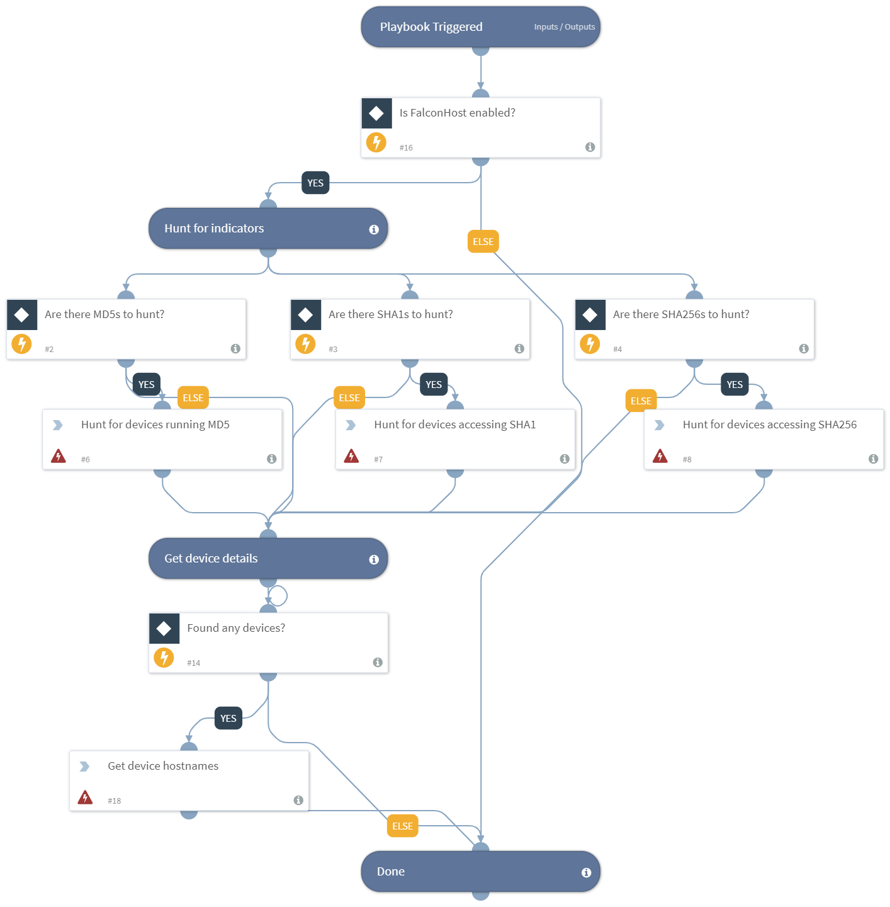

Hunts for endpoint activity involving hash and domain IOCs, using Crowdstrike Falcon Host.

## Dependencies
This playbook uses the following sub-playbooks, integrations, and scripts.

### Sub-playbooks
This playbook does not use any sub-playbooks.

### Integrations
* FalconHost

### Scripts
This playbook does not use any scripts.

### Commands
* cs-device-details
* cs-device-ran-on

## Playbook Inputs
---

| **Name** | **Description** | **Default Value** | **Source** | **Required** |
| --- | --- | --- | --- | --- |
| MD5Hash | The MD5 file hash. | MD5 | File | Optional |
| SHA1Hash | The SHA1 file hash. | SHA1 | File | Optional |
| SHA256Hash | The SHA256 file hash. | SHA256 | File | Optional |

## Playbook Outputs
---

| **Path** | **Description** | **Type** |
| --- | --- | --- |
| Endpoint.Hostname | The device hostname. | string |
| Endpoint | The endpoint. | unknown |

## Playbook Image
---

