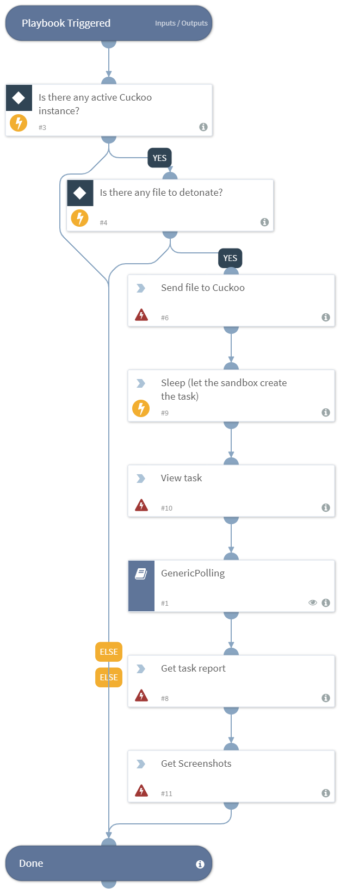

Detonates a file with Cuckoo.

## Dependencies
This playbook uses the following sub-playbooks, integrations, and scripts.

## Sub-playbooks
* GenericPolling

## Integrations
This playbook does not use any integrations.

## Scripts
* Sleep

## Commands
* cuckoo-get-task-report
* cuckoo-task-screenshot
* cuckoo-create-task-from-file
* cuckoo-view-task

## Playbook Inputs
---

| **Name** | **Description** | **Default Value** | **Required** |
| --- | --- | --- | --- | 
| File | The file to detonate. | ${File} | Optional |
| interval | How often to poll for results. | 1 | Optional |
| timeout | How long to wait before giving up waiting for results. | 10 | Optional |

## Playbook Outputs
---

| **Path** | **Description** | **Type** |
| --- | --- | --- |
| Cuckoo.Task.Category | The category of the task. | unknown |
| Cuckoo.Task.Machine | The machine of the task. | unknown |
| Cuckoo.Task.Errors | The errors of the task. | unknown |
| Cuckoo.Task.Traget | The traget of the task. | unknown |
| Cuckoo.Task.Package | The package of the task. | unknown |
| Cuckoo.Task.SampleID | The sample ID of the task. | unknown |
| Cuckoo.Task.Guest | The task of the guest. | unknown |
| Cuckoo.Task.Custom | The custom values of the task. | unknown |
| Cuckoo.Task.Owner | The task of the owner. | unknown |
| Cuckoo.Task.Priority | The priority of the task. | unknown |
| Cuckoo.Task.Platform | The platform of the task. | unknown |
| Cuckoo.Task.Options | The task of the options. | unknown |
| Cuckoo.Task.Status | The task of the status. | unknown |
| Cuckoo.Task.EnforceTimeout | Whether the timeout of the task is enforced. | unknown |
| Cuckoo.Task.Timeout | The task timeout. | unknown |
| Cuckoo.Task.Memory | The task memory. | unknown |
| Cuckoo.Task.Tags | The task tags. | unknown |
| Cuckoo.Task.ID | The ID of the task. | unknown |
| Cuckoo.Task.AddedOn | The date the task was added. | unknown |
| Cuckoo.Task.CompletedOn |The date the task was completed. | unknown |
| Cuckoo.Task.Score | The reported score of the task. | unknown |
| Cuckoo.Task.Monitor | The monitor of the reported task. | unknown |
| File.Size | The size of file. | unknown |
| File.SHA1 | The file's SHA1 hash of the file. | unknown |
| File.SHA256 | The file's SHA256 hash of the file. | unknown |
| File.Name | The file's name. | unknown |
| File.SSDeep | The file's SSDeep hash of the file. | unknown |
| File.EntryID | The file's entry ID. | unknown |
| File.Info | The file's info. | unknown |
| File.Type | The file's type. | unknown |
| File.MD5 | The file's MD5 hash of the file. | unknown |
| File.Extension | The file's extension. | unknown |

## Playbook Image
---

