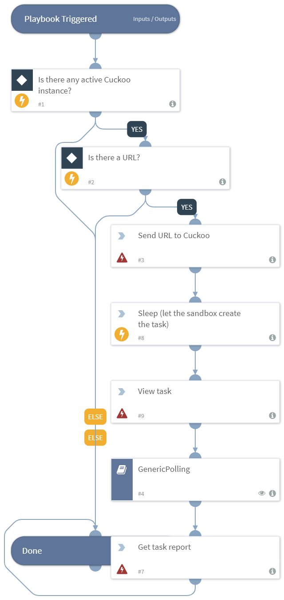

Detonates a URL with Cuckoo.

## Dependencies
This playbook uses the following sub-playbooks, integrations, and scripts.

### Sub-playbooks
* GenericPolling

### Integrations
This playbook does not use any integrations.

### Scripts
* Sleep

### Commands
* cuckoo-view-task
* cuckoo-get-task-report
* cuckoo-create-task-from-url

## Playbook Inputs
---

| **Name** | **Description** | **Default Value** | **Source** | **Required** |
| --- | --- | --- | --- | --- |
| URL | The URL to detonate. | Data | URL | Optional |
| interval | How often to poll for results. | 1 | - | Optional |
| timeout | How long to wait before giving up waiting for results. | 10 | - | Optional |

## Playbook Outputs
---

| **Path** | **Description** | **Type** |
| --- | --- | --- |
| Cuckoo.Task.Category | The category of the task. | unknown |
| Cuckoo.Task.Machine | The machine of the task. | unknown |
| Cuckoo.Task.Errors | The errors of the task. | unknown |
| Cuckoo.Task.Traget | The traget of the task. | unknown |
| Cuckoo.Task.Package | The package of the task. | unknown |
| Cuckoo.Task.SampleID | The sample ID of the task. | unknown |
| Cuckoo.Task.Guest | The task guest. | unknown |
| Cuckoo.Task.Custom | The custom values of task. | unknown |
| Cuckoo.Task.Owner | The task owner. | unknown |
| Cuckoo.Task.Priority | The priority of task. | unknown |
| Cuckoo.Task.Platform | The platform of task. | unknown |
| Cuckoo.Task.Options | The task options. | unknown |
| Cuckoo.Task.Status | The task status. | unknown |
| Cuckoo.Task.EnforceTimeout | Whether the timeout of task is enforced. | unknown |
| Cuckoo.Task.Timeout | The task timeout. | unknown |
| Cuckoo.Task.Memory | The task memory. | unknown |
| Cuckoo.Task.Tags | The task tags. | unknown |
| Cuckoo.Task.ID | The ID of the task. | unknown |
| Cuckoo.Task.AddedOn | The date on which the task was added. | unknown |
| Cuckoo.Task.CompletedOn | The date on which the task was completed. | unknown |
| Cuckoo.Task.Score | The reported score of the the task. | unknown |
| Cuckoo.Task.Monitor | The  monitor of the reported task. | unknown |

## Playbook Image
---

