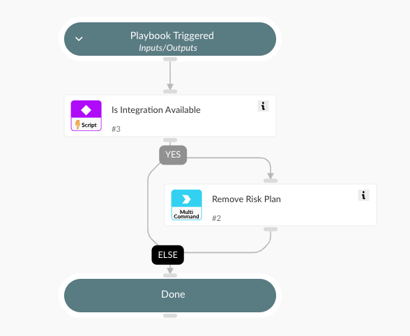

Deactivates a specific CyberArk EPM SOC risk plan for a specified endpoint. This will reset to baseline EPM Policies, effective prior to SOC Response Action.

## Dependencies

This playbook uses the following sub-playbooks, integrations, and scripts.

### Sub-playbooks

This playbook does not use any sub-playbooks.

### Integrations

* CyberArkEPMSOCResponse

### Scripts

This playbook does not use any scripts.

### Commands

* cyberarkepm-deactivate-risk-plan

## Playbook Inputs

---

| **Name** | **Description** | **Default Value** | **Required** |
| --- | --- | --- | --- |
| endpoint_name | FQDN of target endpoint |  | Required |
| endpoint_external_ip | External IP of target endpoint |  | Required |
| risk_plan | Name of Risk Plan to remove \(i.e. Medium_Risk_Plan or High_Risk_Plan\) |  | Required |

## Playbook Outputs

---
There are no outputs for this playbook.

## Playbook Image

---

