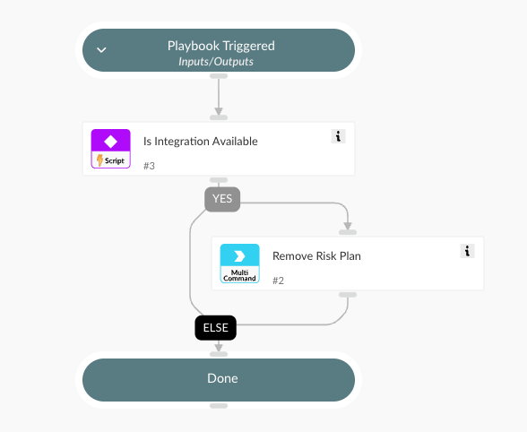

Deactivates a specific CyberArk EPM SOC risk plan for a specific endpoint. This reverts all security settings to the baseline EPM policies active prior to the SOC response action.

## Dependencies

This playbook uses the following sub-playbooks, integrations, and scripts.

### Sub-playbooks

This playbook does not use any sub-playbooks.

### Integrations

This playbook does not use any integrations.

### Scripts

* IsIntegrationAvailable

### Commands

* cyberarkepm-deactivate-risk-plan

## Playbook Inputs

---

| **Name** | **Description** | **Default Value** | **Required** |
| --- | --- | --- | --- |
| endpoint_name | The Hostname of the target endpoint. |  | Required |
| logged_in_user | The logged-in user of the target endpoint. |  | Required |
| risk_plan | The name of the risk plan to remove \(i.e. Medium_Risk_Endpoint or High_Risk_Endpoint\). |  | Required |

## Playbook Outputs

---
There are no outputs for this playbook.

## Playbook Image

---

