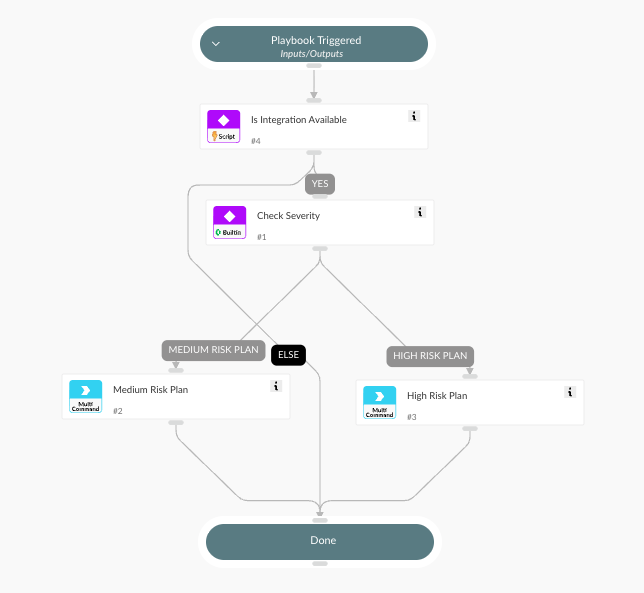

Activates a CyberArk EPM SOC risk plan for a specified endpoint, based on the incident severity. Endpoint name and external IP are taken from the incident to uniquely identify the on EPM

## Dependencies

This playbook uses the following sub-playbooks, integrations, and scripts.

### Sub-playbooks

This playbook does not use any sub-playbooks.

### Integrations

This playbook does not use any integrations.

### Scripts

* IsIntegrationAvailable

### Commands

* cyberarkepm-activate-risk-plan

## Playbook Inputs

---

| **Name** | **Description** | **Default Value** | **Required** |
| --- | --- | --- | --- |
| endpoint_name | Hostname of target endpoint. |  | Required |
| logged_in_user | Logged in user name of target endpoint. |  | Required |

## Playbook Outputs

---
There are no outputs for this playbook.

## Playbook Image

---

