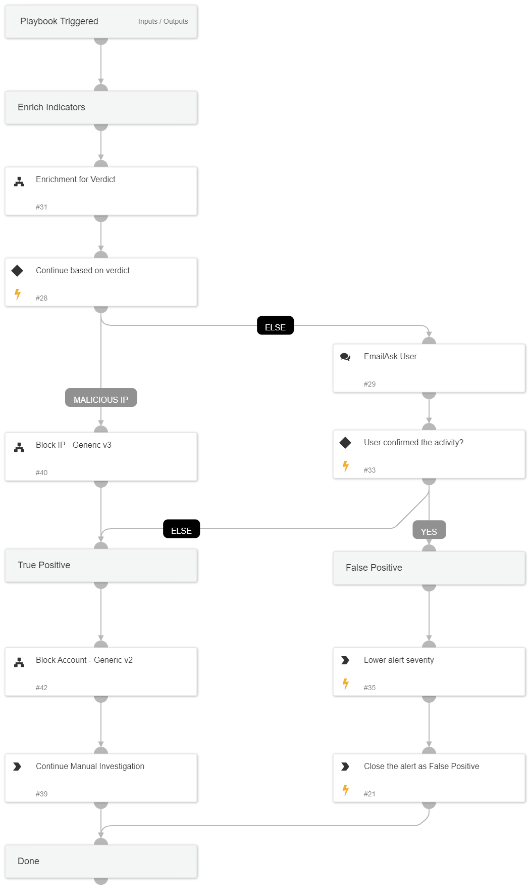

This playbook investigates a “Brute Force” incident by gathering user and IP information  and performs remediation based on the information gathered and received from the user.

Used Sub-playbooks:
* Enrichment for Verdict
* Block IP - Generic v3
* Block Account - Generic v2

## Dependencies
This playbook uses the following sub-playbooks, integrations, and scripts.

### Sub-playbooks
* Block IP - Generic v3
* Block Account - Generic v2
* Enrichment for Verdict

### Integrations
This playbook does not use any integrations.

### Scripts
This playbook does not use any scripts.

### Commands
* setAlert
* closeInvestigation

## Playbook Inputs
---

| **Name** | **Description** | **Default Value** | **Required** |
| --- | --- | --- | --- |
| InternalRange | List of Internal IP ranges |  | Optional |
| UserVerification | Whether to wait for user verification for blocking those IPs.  False - No prompt will be displayed to the user. True - The server will ask the user for blocking verification and will display the blocking list. | True | Optional |

## Playbook Outputs
---
There are no outputs for this playbook.

## Playbook Image
---
