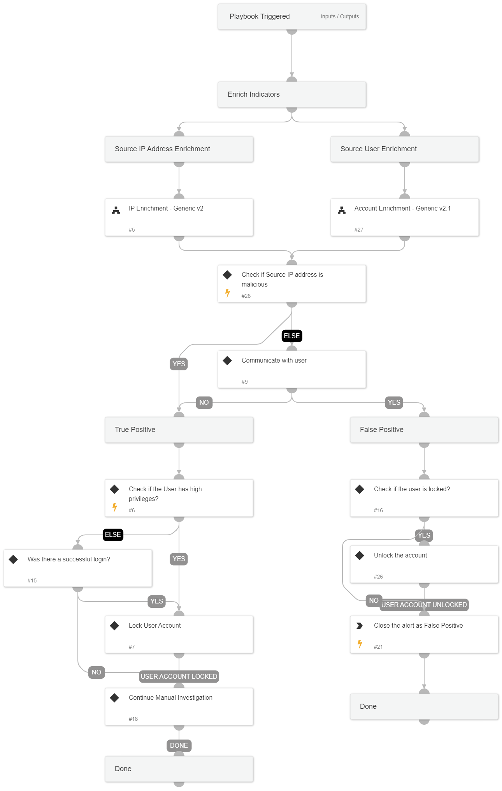

This playbook investigates a “Brute Force” correlation alert by gathering user, IP information and information received from the user, to perform remediation and handle the alert.

## Dependencies
This playbook uses the following sub-playbooks, integrations, and scripts.

### Sub-playbooks
* Account Enrichment - Generic v2.1
* IP Enrichment - Generic v2

### Integrations
This playbook does not use any integrations.

### Scripts
This playbook does not use any scripts.

### Commands
* closeInvestigation

## Playbook Inputs
---

| **Name** | **Description** | **Default Value** | **Required** |
| --- | --- | --- | --- |
| AdminRoles | List of Administrative roles |  | Optional |
| InternalRange | List of Internal IP ranges |  | Optional |

## Playbook Outputs
---
There are no outputs for this playbook.

## Playbook Image
---
