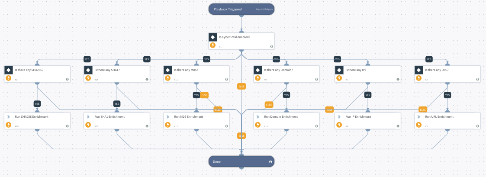

This playbook automatically enriches indicators (including IPs, URLs, domains; MD5, SHA-1, and SHA-256 file hashes). Playbook input: the indicators you want to enrich.  Playbook output: detection engine results, positive detections, detection ratios; as well as severity, confidence, and threat scores.

## Dependencies
This playbook uses the following sub-playbooks, integrations, and scripts.

### Sub-playbooks
This playbook does not use any sub-playbooks.

### Integrations
* CyberTotal

### Scripts
* Exists

### Commands
* file
* ip
* domain
* url

## Playbook Inputs
---

| **Name** | **Description** | **Default Value** | **Required** |
| --- | --- | --- | --- |
| Domain | The input domain will be searched automatically on CyberTotal to retrieve reputation data. | Domain.Name | Optional |
| IP | The input IP will be searched automatically on CyberTotal and to retrieve reputation data. | IP.Address | Optional |
| URL | The input URL will be searched automatically on CyberTotal to retrieve reputation data. | URL.Data | Optional |
| MD5 | The input MD5 will be searched automatically on CyberTotal to retrieve reputation data. | File.MD5 | Optional |
| SHA1 | The input SHA1 will be searched automatically on CyberTotal to retrieve reputation data. | File.SHA1 | Optional |
| SHA256 | The input SHA256 will be searched automatically on CyberTotal to retrieve reputation data. | File.SHA256 | Optional |
| threshold | Threshold for reputation commands. default is 10. | 10 | Optional |

## Playbook Outputs
---

| **Path** | **Description** | **Type** |
| --- | --- | --- |
| CyberTotal.URL.scan_date | Scan date format: ISO 8601 | unknown |
| CyberTotal.URL.resource | The scan target sent to CyberTotal. | unknown |
| CyberTotal.URL.task_id | The unique id of each scan in CyberTotal. | unknown |
| CyberTotal.URL.permalink | The link of this URL’s report in CyberTotal. | unknown |
| CyberTotal.URL.severity | Severity of this URL. The range is from 0 to 10. | unknown |
| CyberTotal.URL.confidence | Confidence of this URL. The range is from 0 to 10. | unknown |
| CyberTotal.URL.threat | Threat of this URL, which is a select from ‘High’, ‘Medium’ and ‘Low’. | unknown |
| CyberTotal.URL.detection_engines | The number of all antivirus vendors scanned. | unknown |
| CyberTotal.URL.positive_detections | The number of antivirus vendors scanned with positive detection. | unknown |
| CyberTotal.URL.detection_ratio | The ratio of positive\_detections and detection\_engines. | unknown |
| CyberTotal.URL.message | Message about this search. | unknown |
| URL.Data | The URL | unknown |
| URL.DetectionEngines | The total number of engines that checked the indicator. | unknown |
| URL.PositiveDetections | The number of engines that positively detected the indicator as malicious. | unknown |
| URL.Malicious.Vendor | The vendor reporting the URL as malicious. | unknown |
| URL.Malicious.Description | A description of the malicious URL. | unknown |
| DBotScore.Indicator | The indicator that was tested. | unknown |
| DBotScore.Type | The indicator type. | unknown |
| DBotScore.Vendor | The vendor used to calculate the score. | unknown |
| DBotScore.Score | The actual score. | unknown |
| CyberTotal.IP.scan_date | Scan date format: ISO 8601 | unknown |
| CyberTotal.IP.resource |  The scan target sent to CyberTotal. | unknown |
| CyberTotal.IP.task_id | The unique id of each scan in CyberTotal. | unknown |
| CyberTotal.IP.permalink | The link of this IP’s report in CyberTotal. | unknown |
| CyberTotal.IP.severity | Severity of this IP. The range is from 0 to 10. | unknown |
| CyberTotal.IP.confidence | Confidence of this IP. The range is from 0 to 10. | unknown |
| CyberTotal.IP.threat | Threat of this IP, which is a select from ‘High’, ‘Medium’ and ‘Low’. | unknown |
| CyberTotal.IP.detection_engines | The number of all antivirus vendors scanned. | unknown |
| CyberTotal.IP.positive_detections | The number of antivirus vendors scanned with positive detection. | unknown |
| CyberTotal.IP.detection_ratio | The ratio of positive\_detections and detection\_engines. | unknown |
| CyberTotal.IP.message | Message about this search. | unknown |
| IP.Address | IP address | unknown |
| IP.DetectionEngines | The total number of engines that checked the indicator. | unknown |
| IP.PositiveDetections | The number of engines that positively detected the indicator as malicious. | unknown |
| IP.Malicious.Vendor | The vendor reporting the IP address as malicious. | unknown |
| IP.Malicious.Description | A description explaining why the IP address was reported as malicious. | unknown |
| CyberTotal.Domain.scan_date | Scan date format: ISO 8601 | unknown |
| CyberTotal.Domain.resource | The scan target sent to CyberTotal. | unknown |
| CyberTotal.Domain.permalink | The link of this domain’s report in CyberTotal. | unknown |
| CyberTotal.Domain.severity | Severity of this domain. The range is from 0 to 10. | unknown |
| CyberTotal.Domain.confidence | Confidence of this domain. The range is from 0 to 10. | unknown |
| CyberTotal.Domain.threat | Threat of this domain, which is a select from ‘High’, ‘Medium’ and ‘Low’. | unknown |
| CyberTotal.Domain.detection_engines | The number of all antivirus vendors scanned. | unknown |
| CyberTotal.Domain.positive_detections | The number of antivirus vendors scanned with positive detection. | unknown |
| CyberTotal.Domain.detection_ratio | The ratio of positive\_detections and detection\_engines. | unknown |
| CyberTotal.Domain.message | Message about this search. | unknown |
| Domain.Name | The domain name, for example: "google.com". | unknown |
| Domain.DetectionEngines | The total number of engines that checked the indicator. | unknown |
| Domain.PositiveDetections | The number of engines that positively detected the indicator as malicious. | unknown |
| Domain.Malicious.Vendor | The vendor reporting the domain as malicious. | unknown |
| Domain.Malicious.Description | A description explaining why the domain was reported as malicious. | unknown |
| CyberTotal.File.scan_date | Scan date format: ISO 8601 | unknown |
| CyberTotal.File.resource | The scan target sent to CyberTotal. | unknown |
| CyberTotal.File.task_id | The unique id of each scan in CyberTotal. | unknown |
| CyberTotal.File.permalink | The link of this HASH’s report in CyberTotal. | unknown |
| CyberTotal.File.severity | Severity of this HASH. The range is from 0 to 10. | unknown |
| CyberTotal.File.confidence | Confidence of this HASH. The range is from 0 to 10. | unknown |
| CyberTotal.File.threat | Threat of this HASH, which is a select from ‘High’, ‘Medium’ and ‘Low’. | unknown |
| CyberTotal.File.detection_engines | The number of all antivirus vendors scanned. | unknown |
| CyberTotal.File.positive_detections | The number of antivirus vendors scanned with positive detection. | unknown |
| CyberTotal.File.detection_ratio | The ratio of positive\_detections and detection\_engines. | unknown |
| CyberTotal.File.message | Message about this search. | unknown |
| CyberTotal.File.size | Size of this file. | unknown |
| CyberTotal.File.md5 | This file’s md5 value. | unknown |
| CyberTotal.File.sha1 | This file’s sha1 value. | unknown |
| CyberTotal.File.sha256 | This file’s sha256 value. | unknown |
| CyberTotal.File.extension | This file’s extension type. | unknown |
| CyberTotal.File.name | This file’s name, separated by ‘,’ if more than 2 names. | unknown |
| File.MD5 | The MD5 hash of the file. | unknown |
| File.SHA1 | The SHA1 hash of the file. | unknown |
| File.SHA256 | The SHA1 hash of the file. | unknown |
| File.Name | The full file name \(including file extension\). | unknown |
| File.Extension | The file extension, for example: 'xls'. | unknown |
| File.Size | The size of the file in bytes. | unknown |

## Playbook Image
---

