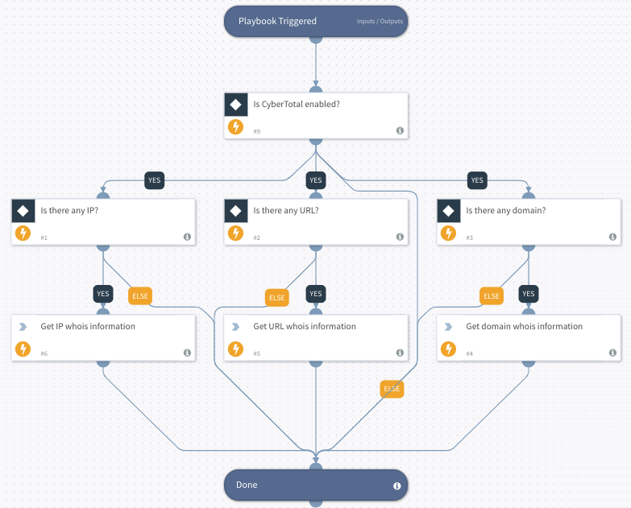

This playbook is used to automatically retrieve Whois information regarding IPs, URLs and domains. Playbook input: IPs, URLs, domains. Playbook output: Whois lookup information.

## Dependencies
This playbook uses the following sub-playbooks, integrations, and scripts.

### Sub-playbooks
This playbook does not use any sub-playbooks.

### Integrations
* CyberTotal

### Scripts
* Exists

### Commands
* cybertotal-url-whois
* cybertotal-domain-whois
* cybertotal-ip-whois

## Playbook Inputs
---

| **Name** | **Description** | **Default Value** | **Required** |
| --- | --- | --- | --- |
| Domain | The input domain will be searched automatically on CyberTotal to retrieve whois information. | Domain.Name | Optional |
| IP | The input ip will be searched automatically on CyberTotal to retrieve whois information. | IP.Address | Optional |
| URL | The input url will be searched automatically on CyberTotal to retrieve whois information. | URL.Data | Optional |

## Playbook Outputs
---

| **Path** | **Description** | **Type** |
| --- | --- | --- |
| CyberTotal.WHOIS-Domain.scan_date | Scan date format: ISO 8601 | unknown |
| CyberTotal.WHOIS-Domain.task_id | The unique id of each scan in CyberTotal. | unknown |
| CyberTotal.WHOIS-Domain.resource | The scan target sent to CyberTotal. | unknown |
| CyberTotal.WHOIS-Domain.message | Message about this search. | unknown |
| CyberTotal.WHOIS-Domain.permalink | The link of this whois report in CyberTotal. | unknown |
| CyberTotal.WHOIS-Domain.createdAt | Create date format: ISO 8601 | unknown |
| CyberTotal.WHOIS-Domain.updatedAt | Update date format: ISO 8601 | unknown |
| CyberTotal.WHOIS-Domain.status | Status of this Domain | unknown |
| CyberTotal.WHOIS-Domain.domain | Top level Domain of this domain | unknown |
| CyberTotal.WHOIS-Domain.domainMd5 | MD5 translation of CyberTotal.WHOIS\-Domain.domain | unknown |
| CyberTotal.WHOIS-Domain.domainUnicode | Encode CyberTotal.WHOIS\-Domain.domain by using unicode | unknown |
| CyberTotal.WHOIS-Domain.nameservers | An array of all DNS nameservers | unknown |
| CyberTotal.WHOIS-Domain.registrarName | The name of registrar | unknown |
| CyberTotal.WHOIS-Domain.registrarEmail | The email address of registrar | unknown |
| CyberTotal.WHOIS-Domain.registrarPhone | The phone number of registrar | unknown |
| CyberTotal.WHOIS-Domain.registrarCreatedAt | Registrar create date format: ISO 8601 | unknown |
| CyberTotal.WHOIS-Domain.registrarUpdatedAt | Registrar update date format: ISO 8601 | unknown |
| CyberTotal.WHOIS-Domain.registrarExpiresAt | Registrar expire date format: ISO 8601 | unknown |
| CyberTotal.WHOIS-Domain.auditCreatedAt | Registrar update date format: ISO 8601 | unknown |
| CyberTotal.WHOIS-Domain.auditUpdatedAt | Registrar expire date format: ISO 8601 | unknown |
| CyberTotal.WHOIS-Domain.contactEmails | An array of all contact email address | unknown |
| CyberTotal.WHOIS-Domain.contacts | An array of all contact details | unknown |
| CyberTotal.WHOIS-Domain.contactNames | An array of all contact names | unknown |
| CyberTotal.WHOIS-Domain.contactCountries | An array of all contact countries | unknown |
| CyberTotal.WHOIS-Domain.domainAvailable | If this domain is available | unknown |
| CyberTotal.WHOIS-Domain.expired | If this domain is expired | unknown |
| CyberTotal.WHOIS-Domain.registrant.name | The name of registrant | unknown |
| CyberTotal.WHOIS-Domain.registrant.organization | The organization name of registrant | unknown |
| CyberTotal.WHOIS-Domain.registrant.street | The street name of registrant | unknown |
| CyberTotal.WHOIS-Domain.registrant.city | The location city of registrant | unknown |
| CyberTotal.WHOIS-Domain.registrant.state | The location state name of registrant | unknown |
| CyberTotal.WHOIS-Domain.registrant.zip | The post zip code of registrant | unknown |
| CyberTotal.WHOIS-Domain.registrant.country | The country of registrant | unknown |
| CyberTotal.WHOIS-Domain.registrant.address | The address of registrant | unknown |
| CyberTotal.WHOIS-Domain.admin.name | The name of admin | unknown |
| CyberTotal.WHOIS-Domain.admin.organization | The organization name of admin | unknown |
| CyberTotal.WHOIS-Domain.admin.street | The street name of admin | unknown |
| CyberTotal.WHOIS-Domain.admin.city | The location city of admin | unknown |
| CyberTotal.WHOIS-Domain.admin.state | The location state name of admin | unknown |
| CyberTotal.WHOIS-Domain.admin.zip | The post zip code of admin | unknown |
| CyberTotal.WHOIS-Domain.admin.country | The country of admin | unknown |
| CyberTotal.WHOIS-Domain.admin.address | The address of admin | unknown |
| CyberTotal.WHOIS-Domain.technical.name | The name of technical | unknown |
| CyberTotal.WHOIS-Domain.technical.organization | The organization name of technical | unknown |
| CyberTotal.WHOIS-Domain.technical.street | The street name of technical | unknown |
| CyberTotal.WHOIS-Domain.technical.city | The location city of technical | unknown |
| CyberTotal.WHOIS-Domain.technical.state | The location state name of technical | unknown |
| CyberTotal.WHOIS-Domain.technical.zip | The post zip code of technical | unknown |
| CyberTotal.WHOIS-Domain.technical.country | The country of technical | unknown |
| CyberTotal.WHOIS-Domain.technical.address | The address of technical | unknown |
| CyberTotal.WHOIS-URL.scan_date | Scan date format: ISO 8601 | unknown |
| CyberTotal.WHOIS-URL.task_id | The unique id of each scan in CyberTotal. | unknown |
| CyberTotal.WHOIS-URL.resource | The scan target sent to CyberTotal. | unknown |
| CyberTotal.WHOIS-URL.message | Message about this search. | unknown |
| CyberTotal.WHOIS-URL.permalink | The link of this whois report in CyberTotal. | unknown |
| CyberTotal.WHOIS-URL.createdAt | Create date format: ISO 8601 | unknown |
| CyberTotal.WHOIS-URL.updatedAt | Update date format: ISO 8601 | unknown |
| CyberTotal.WHOIS-URL.status | Status of this IP | unknown |
| CyberTotal.WHOIS-URL.domain | Domain of this IP | unknown |
| CyberTotal.WHOIS-URL.domainMd5 | MD5 translation of CyberTotal.WHOIS\-URL.domain | unknown |
| CyberTotal.WHOIS-URL.domainUnicode | Encode CyberTotal.WHOIS\-URL.domain by using unicode | unknown |
| CyberTotal.WHOIS-URL.nameservers | An array of all DNS nameservers | unknown |
| CyberTotal.WHOIS-URL.registrarName | The name of registrar | unknown |
| CyberTotal.WHOIS-URL.registrarEmail | The email address of registrar | unknown |
| CyberTotal.WHOIS-URL.registrarPhone | The phone number of registrar | unknown |
| CyberTotal.WHOIS-URL.registrarCreatedAt | Registrar create date format: ISO 8601 | unknown |
| CyberTotal.WHOIS-URL.registrarUpdatedAt | Registrar update date format: ISO 8601 | unknown |
| CyberTotal.WHOIS-URL.registrarExpiresAt | Registrar expire date format: ISO 8601 | unknown |
| CyberTotal.WHOIS-URL.auditCreatedAt | Registrar update date format: ISO 8601 | unknown |
| CyberTotal.WHOIS-URL.auditUpdatedAt | Registrar expire date format: ISO 8601 | unknown |
| CyberTotal.WHOIS-URL.contactEmails | An array of all contact email address | unknown |
| CyberTotal.WHOIS-URL.contacts | An array of all contact details | unknown |
| CyberTotal.WHOIS-URL.contactNames | An array of all contact names | unknown |
| CyberTotal.WHOIS-URL.contactCountries | An array of all contact countries | unknown |
| CyberTotal.WHOIS-URL.domainAvailable | If this domain is available | unknown |
| CyberTotal.WHOIS-URL.expired | If this URL is expired | unknown |
| CyberTotal.WHOIS-URL.registrant.name | The name of registrant | unknown |
| CyberTotal.WHOIS-URL.registrant.organization | The organization name of registrant | unknown |
| CyberTotal.WHOIS-URL.registrant.street | The street name of registrant | unknown |
| CyberTotal.WHOIS-URL.registrant.city | The location city of registrant | unknown |
| CyberTotal.WHOIS-URL.registrant.state | The location state name of registrant | unknown |
| CyberTotal.WHOIS-URL.registrant.zip | The post zip code of registrant | unknown |
| CyberTotal.WHOIS-URL.registrant.country | The country of registrant | unknown |
| CyberTotal.WHOIS-URL.registrant.address | The address of registrant | unknown |
| CyberTotal.WHOIS-URL.admin.name | The name of admin | unknown |
| CyberTotal.WHOIS-URL.admin.organization | The organization name of admin | unknown |
| CyberTotal.WHOIS-URL.admin.street | The street name of admin | unknown |
| CyberTotal.WHOIS-URL.admin.city | The location city of admin | unknown |
| CyberTotal.WHOIS-URL.admin.state | The location state name of admin | unknown |
| CyberTotal.WHOIS-URL.admin.zip | The post zip code of admin | unknown |
| CyberTotal.WHOIS-URL.admin.country | The country of admin | unknown |
| CyberTotal.WHOIS-URL.admin.address | The address of admin | unknown |
| CyberTotal.WHOIS-URL.technical.name | The name of technical | unknown |
| CyberTotal.WHOIS-URL.technical.organization | The organization name of technical | unknown |
| CyberTotal.WHOIS-URL.technical.street | The street name of technical | unknown |
| CyberTotal.WHOIS-URL.technical.city | The location city of technical | unknown |
| CyberTotal.WHOIS-URL.technical.state | The location state name of technical | unknown |
| CyberTotal.WHOIS-URL.technical.zip | The post zip code of technical | unknown |
| CyberTotal.WHOIS-URL.technical.country | The country of technical | unknown |
| CyberTotal.WHOIS-URL.technical.address | The address of technical | unknown |
| CyberTotal.WHOIS-IP.scan_date | Scan date format: ISO 8601 | unknown |
| CyberTotal.WHOIS-IP.task_id | The unique id of each scan in CyberTotal. | unknown |
| CyberTotal.WHOIS-IP.resource | The scan target sent to CyberTotal. | unknown |
| CyberTotal.WHOIS-IP.message | Message about this search. | unknown |
| CyberTotal.WHOIS-IP.permalink | The link of this whois report in CyberTotal. | unknown |
| CyberTotal.WHOIS-IP.createdAt | Create date format: ISO 8601 | unknown |
| CyberTotal.WHOIS-IP.updatedAt | Update date format: ISO 8601 | unknown |
| CyberTotal.WHOIS-IP.status | Status of this IP | unknown |
| CyberTotal.WHOIS-IP.domain | Domain of this IP | unknown |
| CyberTotal.WHOIS-IP.domainMd5 | MD5 translation of CyberTotal.WHOIS\-IP.domain | unknown |
| CyberTotal.WHOIS-IP.domainUnicode | Encode CyberTotal.WHOIS\-IP.domain by using unicode | unknown |
| CyberTotal.WHOIS-IP.nameservers | An array of all DNS nameservers | unknown |
| CyberTotal.WHOIS-IP.registrarName | The name of registrar | unknown |
| CyberTotal.WHOIS-IP.registrarEmail | The email address of registrar | unknown |
| CyberTotal.WHOIS-IP.registrarPhone | The phone number of registrar | unknown |
| CyberTotal.WHOIS-IP.registrarCreatedAt | Registrar create date format: ISO 8601 | unknown |
| CyberTotal.WHOIS-IP.registrarUpdatedAt | Registrar update date format: ISO 8601 | unknown |
| CyberTotal.WHOIS-IP.registrarExpiresAt | Registrar expire date format: ISO 8601 | unknown |
| CyberTotal.WHOIS-IP.auditCreatedAt | Registrar update date format: ISO 8601 | unknown |
| CyberTotal.WHOIS-IP.auditUpdatedAt | Registrar expire date format: ISO 8601 | unknown |
| CyberTotal.WHOIS-IP.contactEmails | An array of all contact email address | unknown |
| CyberTotal.WHOIS-IP.contacts | An array of all contact details | unknown |
| CyberTotal.WHOIS-IP.contactNames | An array of all contact names | unknown |
| CyberTotal.WHOIS-IP.contactCountries | An array of all contact countries | unknown |
| CyberTotal.WHOIS-IP.domainAvailable | If this domain is available | unknown |
| CyberTotal.WHOIS-IP.expired | If this IP is expired | unknown |
| CyberTotal.WHOIS-IP.registrant.name | The name of registrant | unknown |
| CyberTotal.WHOIS-IP.registrant.organization | The organization name of registrant | unknown |
| CyberTotal.WHOIS-IP.registrant.street | The street name of registrant | unknown |
| CyberTotal.WHOIS-IP.registrant.city | The location city of registrant | unknown |
| CyberTotal.WHOIS-IP.registrant.state | The location state name of registrant | unknown |
| CyberTotal.WHOIS-IP.registrant.zip | The post zip code of registrant | unknown |
| CyberTotal.WHOIS-IP.registrant.country | The country of registrant | unknown |
| CyberTotal.WHOIS-IP.registrant.address | The address of registrant | unknown |
| CyberTotal.WHOIS-IP.admin.name | The name of admin | unknown |
| CyberTotal.WHOIS-IP.admin.organization | The organization name of admin | unknown |
| CyberTotal.WHOIS-IP.admin.street | The street name of admin | unknown |
| CyberTotal.WHOIS-IP.admin.city | The location city of admin | unknown |
| CyberTotal.WHOIS-IP.admin.state | The location state name of admin | unknown |
| CyberTotal.WHOIS-IP.admin.zip | The post zip code of admin | unknown |
| CyberTotal.WHOIS-IP.admin.country | The country of admin | unknown |
| CyberTotal.WHOIS-IP.admin.address | The address of admin | unknown |
| CyberTotal.WHOIS-IP.technical.name | The name of technical | unknown |
| CyberTotal.WHOIS-IP.technical.organization | The organization name of technical | unknown |
| CyberTotal.WHOIS-IP.technical.street | The street name of technical | unknown |
| CyberTotal.WHOIS-IP.technical.city | The location city of technical | unknown |
| CyberTotal.WHOIS-IP.technical.state | The location state name of technical | unknown |
| CyberTotal.WHOIS-IP.technical.zip | The post zip code of technical | unknown |
| CyberTotal.WHOIS-IP.technical.country | The country of technical | unknown |
| CyberTotal.WHOIS-IP.technical.address | The address of technical | unknown |

## Playbook Image
---

